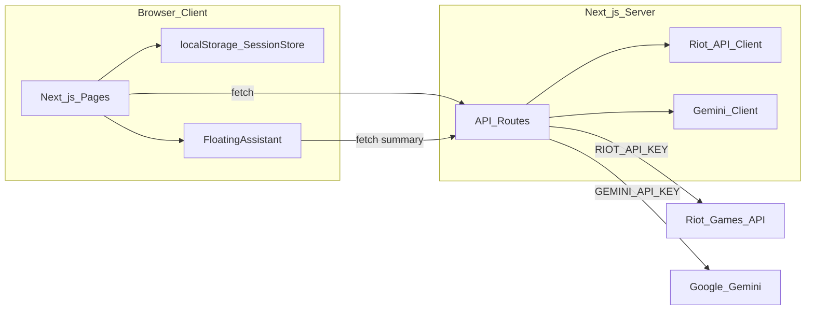
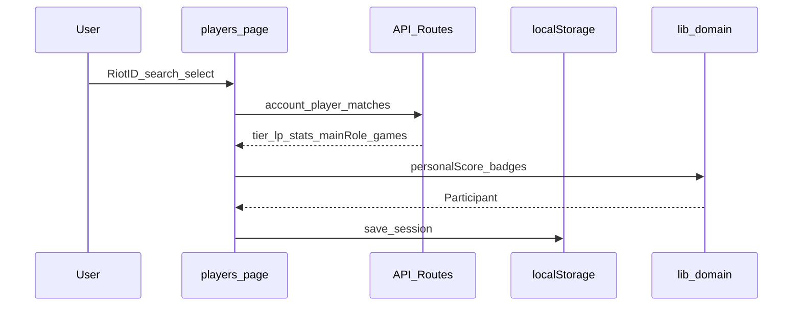
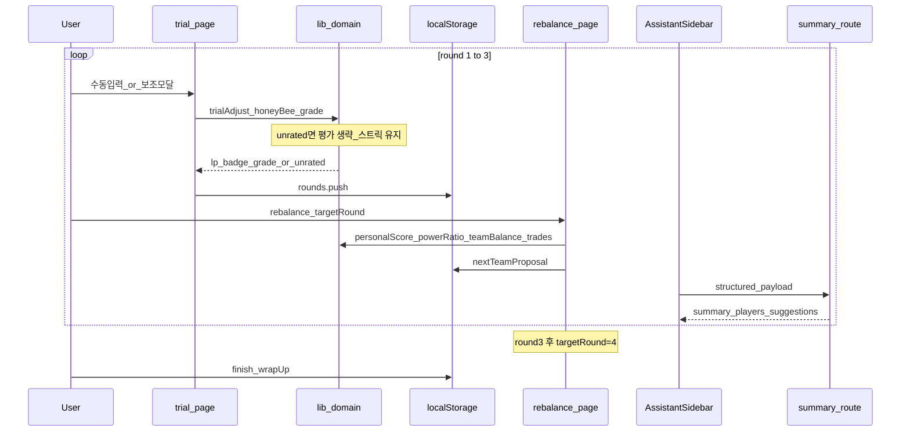

# 내전 총무 — 구현 계획

> **문서 버전:** v3.0.1  
> **기준 문서:** [constitution.md](./constitution.md), [spec.md](./spec.md) v4.0.2, [feedback.md](./feedback.md), [design-system.md](./design-system.md) v0.6.2  
> **상태:** 4차 반복 — Phase 0~9 재구현·자동 검증 완료, 실 API/브라우저 QA 대기  
> **다음 단계:** [tasks.md](./tasks.md) Phase별 Task 재분해

---

## 1. 목적

[spec.md](./spec.md) v4.0에 정의된 MVP를 **Next.js + TypeScript + 전역 SCSS**로 **처음부터 재구현**한다.  
3차 구현 코드는 삭제되었고, 본 문서는 **어떤 순서로, 어떤 구조로** 다시 만들지 정한다. 개별 Task의 완료 조건·검증은 **작업 정의**(`tasks.md`)에서 분리한다.

### 4차에서 새로 넣는 것 (feedback "3차 시도 최종 피드백")

- CSS Modules를 제거하고 `tg-` 접두사 BEM 전역 SCSS로 전환한다.
- AI를 말풍선 요약에서 우측 사이드바 챗봇으로 확장한다(예시 질문 3개, 후속 질문, 주목 선수).
- 팀 제안·시험 결과 저장 후 2~3초 분석 전환 화면을 제공한다.
- 태그 없는 입력은 로컬 최근 등록 선수만 검색하고, 이전 플레이어 모달을 제공한다.
- OP 기준을 강화하고 OP가 없을 때 내부 1~5티어를 기본으로 한다.
- 시험 입력에 승리팀 컬러 토글·챔피언·실제 라인을 추가하고 양 팀을 좌측 정렬한다.
- 마무리는 세션명·승리팀·MVP·최다 꿀벌을 순차 공개한 뒤 전체 결과를 보여준다.
- 개발자 이스터에그 태그는 `lib/constants/easterEggs.ts`에 하드코딩하며, 카드 UI만 조회하고 점수·배정 로직은 건드리지 않는다.

### 3차에서 새로 넣는 것 (feedback "2차 시도")

3차의 핵심은 **모션·정보 구조·대치 구도**다. 기능은 2차와 동일하되, 정적·딱딱한 인상을 걷어낸다. 모션은 **가독성·성능·접근성**(`prefers-reduced-motion`)을 해치지 않는 선에서만 쓴다.

| 영역 | 유지(2차 기준) | 3차에서 **새로** 넣는 것 |
|------|----------------|---------------------------|
| 모션 | (정적) | **D-14 모션 시스템** — 단계 전환 페이드·순차 등장·팀 슬라이드 인·`ease-in-out` |
| 진입 | 랜딩 → 세션 | **소개형 랜딩 + 상단 배너(중앙 로고)** → **대시보드(F-12)** |
| 홈 | (세션 목록만) | **대시보드** — 총무 인사·내 플레이어·세션 그리드(상태·평점) (D-15) |
| 팀 UI | 가독성·비율·평균 | **블루팀 우측 정렬 대치**(D-16), 하단 버튼 구역, 팀 박스 미니 모달, 근거 우상단 hover |
| 참가자 등록 | 간략 카드·본캐 경고 | 좌5/우5 순차, 안내 소형 텍스트, **hover 상세 모달**, CTA **그라디언트** |
| 시험 입력 | 수동·경기ID·이미지·폼 유지 | 판 탭 우상단 고정, **참가자 최근 경기 목록 선택**, 4판 전 종료 버튼 |
| 재밸런스 | 팀 중심·트레이드·증감 | 교체 **border 강조 + 들어온/나간 표시** |
| 마무리 | 총평·평가·피드백·후원 | **승리팀 컬러 대표 박스**·결과 컬러 칩·**별점 1~5** → 대시보드 반영 |

### 이전 반복(2차) 기준 — 유지

| 영역 | 내용 |
|------|------|
| 팀 UI | 블루/레드 **가독성 구분**, 평균 티어 헤더, **51% vs 49%** 전력 비율 |
| AI | **Gemini** + **플로팅 어시스턴트** (`/summary` 없음) |
| 성과 | **F~OP 등급**, **`unrated`**(기대치 산출 불가) |
| 주 라인 | **라인 아이콘**(자체 SVG) |
| 시험 입력 | 수동·경기ID·이미지, **보조=작은 버튼+모달**, placeholder, **폼 상태 유지** |
| 재밸런스 | **팀 중심** 레이아웃 · `A↔G` 트레이드 · 개인점수 ▲/▼ n% |
| 마무리 | **`/finish`** 총평·평가·피드백 + **후원(F-11)** |

### MVP 핵심 E2E

```
랜딩(소개) → 대시보드 → 새 내전 / 세션 재진입 → 8~10명 등록·전력 분석
  → 1판 팀 제안(스왑·전력 비율·AI 팀 색 멘트)
  → 1판 시험 입력(수동 + 보조 모달: 경기 ID / 이미지)
      → LP 누적 · (가능하면) 꿀벌·F~OP · unrated면 평가 생략
  → 2판 재밸런스 → 시험 → 3판 재밸런스 → 시험 → 4판 재밸런스
  → 내전 종료(/finish) · 총평 · (선택) 평가·피드백 · 후원
  (4판은 제안·수동 구성만, 시험 판 입력 없음)
  AI 요약은 전 구간 플로팅 어시스턴트로 제공
```

---

## 2. 아키텍처 개요

### 2.1 시스템 구성



| 계층 | 역할 |
|------|------|
| **Client (App Router)** | UI, localStorage CRUD, 도메인 로직(팀 배정·뱃지·LP·등급·unrated) |
| **API Routes** | Riot·Gemini 프록시, Key 보호, rate limit·에러 정규화 |
| **lib/** | 순수 TypeScript 도메인 로직 (명세 D-02~D-13) |
| **localStorage** | 세션·참가자·팀 제안·시험 판·마무리(`wrapUp`) |

### 2.2 설계 원칙 (헌법 준수)

- 명세에 없는 기능 추가 금지
- Riot / Gemini API Key는 **서버 환경 변수만** (`RIOT_API_KEY`, `GEMINI_API_KEY`)
- 도메인 로직은 UI와 분리 (`lib/`) — 동일 로직이 2곳 이상에서 쓰일 때만 추상화
- 알고리즘·수식은 spec D-02, D-06, D-07, D-11, D-12와 1:1 대응
- **기대치 결측을 0으로 대체 금지** (D-07 `unrated`)

### 2.3 기술 스택

| 항목 | 선택 |
|------|------|
| 프레임워크 | Next.js (App Router) |
| 언어 | TypeScript (strict) |
| 스타일 | SCSS Modules (`*.module.scss`) |
| 상태 | React state + localStorage (전역 상태 라이브러리 MVP 제외) |
| AI | Google Gemini (텍스트 + 멀티모달 Vision) |
| ID | `crypto.randomUUID()` |
| 배포 | Vercel 또는 Node 호스팅 (환경 변수로 Key) |

### 2.4 디자인 시스템

UI 구현은 [design-system.md](./design-system.md)를 기준으로 한다.

- Hextech Glass 토큰·공용 컴포넌트 규칙 준수
- **블루/레드 팀 컬럼**은 Phase 5부터 **가독성 우선**으로 팀 색을 적용한다 (D-12 기본). 2차 “특별 꾸밈”이 아니라 MVP 기본이다
- 장식용 과도한 그라디언트·글로우·애니메이션은 쓰지 않는다. 텍스트·뱃지 대비를 해치지 않는다
- 라인 아이콘·꿀벌·성과 등급·`기록 부족`은 색만으로 구분하지 않고 아이콘+텍스트를 병행한다
- 플로팅 어시스턴트는 핵심 콘텐츠를 가리지 않는 우측 하단 고정 레이어로 둔다

---

## 3. 프로젝트 구조 (목표)

```
team_gap/
├── documents/
│   ├── constitution.md
│   ├── spec.md
│   ├── feedback.md
│   ├── design-system.md
│   ├── implementation-plan.md      # 본 문서
│   ├── tasks.md
│   └── release-checklist.md
├── .env.local.example
├── package.json
├── next.config.ts
├── tsconfig.json
├── app/
│   ├── layout.tsx                    # 공통 크롬 + TopBanner(중앙 로고, D-14)
│   ├── page.tsx                      # 소개형 랜딩 F-01
│   ├── dashboard/page.tsx            # 대시보드 F-12 (총무 인사·세션 그리드)
│   ├── globals.scss
│   ├── api/
│   │   ├── riot/
│   │   │   ├── account/route.ts
│   │   │   ├── account/search/route.ts
│   │   │   ├── player/route.ts
│   │   │   ├── matches/route.ts      # 참가자 최근 경기 목록 (F-05 A')
│   │   │   ├── match/[id]/route.ts
│   │   │   ├── vision/route.ts       # Gemini 멀티모달 (F-09)
│   │   │   └── summary/route.ts      # Gemini 텍스트 (F-08)
│   │   └── ddragon/
│   │       └── bootstrap/route.ts
│   └── session/
│       └── [id]/
│           ├── layout.tsx
│           ├── players/page.tsx      # F-02, F-03
│           ├── team/page.tsx         # F-04
│           ├── trial/page.tsx        # F-05
│           ├── rebalance/page.tsx    # F-06
│           └── finish/page.tsx       # F-10, F-11  (summary 페이지 없음)
├── components/
│   ├── layout/                   # TopBanner, BackLink, PageHeader, StepNav
│   ├── motion/                   # FadeStage, Stagger, TeamSlideIn (D-14 래퍼)
│   ├── dashboard/                # DashboardGreeting, SessionGrid, SessionCard, MyPlayerPicker
│   ├── player/                   # RiotIdSearch, PlayerCard(간략), PlayerHoverCard, LaneIcon
│   ├── team/                     # TeamColumn(대치 정렬), PowerRatioBar, TradeList, MiniAddModal, BalanceReasonPopover
│   ├── trial/                    # TrialForm, AssistModal(MatchId/RecentMatches/Vision), VisionReview
│   ├── assistant/                # FloatingAssistant, bubble, mode toggle
│   └── shared/                   # ReasonPanel, TierEmblem, Badge, ProfileIcon, ChampionIcon, StarRating
├── lib/
│   ├── types/                    # UserProfile, Session(+status/wrapUp), Participant, TeamProposal, …
│   ├── storage/
│   │   ├── sessionStore.ts
│   │   └── userProfile.ts        # D-15 총무 프로필(내 플레이어·이름)
│   ├── riot/
│   │   └── ddragon/
│   ├── gemini/                   # 서버 전용 클라이언트 래퍼(요약·비전)
│   ├── constants/
│   │   ├── lpTable.ts
│   │   ├── synergy.ts
│   │   ├── performanceGrade.ts   # D-11 임계값
│   │   └── donation.ts           # F-11 계좌·링크 상수
│   ├── domain/
│   │   ├── winRate.ts
│   │   ├── personalScore.ts
│   │   ├── badges.ts
│   │   ├── teamBalance.ts
│   │   ├── powerRatio.ts         # D-12 bluePowerPct / redPowerPct
│   │   ├── trialAdjust.ts
│   │   ├── honeyBee.ts           # D-07 + unrated
│   │   ├── performanceGrade.ts   # D-11 (unrated → null)
│   │   ├── teamChange.ts         # F-06 A↔G 트레이드 산출
│   │   ├── sessionStatus.ts      # D-15 preparing/in_progress/completed 파생
│   │   ├── synergy.ts
│   │   └── reasonCopy.ts
│   ├── hooks/
│   │   └── useReducedMotion.ts   # D-14 prefers-reduced-motion
│   └── utils/
│       ├── normalize.ts          # null 스킵 min-max (0 대체 금지)
│       └── parseStatNumber.ts
└── styles/                       # design-system.md §7
    ├── abstracts/
    │   └── _motion.scss          # D-14 이징·지속시간·keyframes 토큰
    ├── base/
    ├── utilities/
    └── globals.scss
```

> **삭제된 경로:** `app/session/[id]/summary` — AI는 플로팅 어시스턴트로만 제공 (D-10).
> **신규 경로:** `app/dashboard` (F-12), `components/motion/`·`components/dashboard/`, `styles/abstracts/_motion.scss` (D-14/D-15).

---

## 4. 구현 단계 (Phase)

각 Phase는 **이전 Phase 완료 후** 진행을 권장한다. Phase 내 Task는 작업 정의에서 병렬 가능 여부를 표시한다.

### Phase 0 — 프로젝트 초기화

| 목표 | 산출물 |
|------|--------|
| Next.js + TS + SCSS 보일러플레이트 | 실행 가능한 `npm run dev` |
| 환경 변수 템플릿 | `.env.local.example` (`RIOT_API_KEY`, `DDRAGON_FALLBACK_VERSION`, **`GEMINI_API_KEY`**) |
| 기본 레이아웃·한국어 `lang` | `app/layout.tsx` |
| 디자인 시스템 토큰 뼈대 | `styles/abstracts/*`, `styles/base/*`, `styles/utilities/*`, `styles/globals.scss` |

**검증:** 빈 랜딩 페이지 로드, API Key 클라이언트 번들 미포함. `OPENAI_API_KEY` 미사용.

---

### Phase 1 — 타입·저장소·랜딩 (F-01)

| 목표 | spec 매핑 |
|------|-----------|
| `lib/types` — spec §6 데이터 모델 | Session(+`wrapUp`), Participant(+`unrated`/`performanceGrade`/`personalScoreDelta`), TeamProposal(+`bluePowerPct`/`redPowerPct`), `TeamChange` |
| `lib/storage/sessionStore.ts` | D-01 |
| 랜딩(소개) + 대시보드(세션 생성·목록·재진입) | F-01, F-12 |
| 세션 layout + StepNav | players → team → trial → rebalance → **finish** |

**검증:** 세션 생성·새로고침 후 유지·목록에서 재진입.

---

### Phase 2 — Riot · Data Dragon · Gemini 서버 레이어

| API Route | 외부 API | 용도 |
|-----------|----------|------|
| `GET /api/riot/account` | Account V1 | PUUID exact (F-02) |
| `GET /api/riot/account/search` | Account V1 | debounce 검색 KR1~KR5 (D-09) |
| `GET /api/riot/player` | Summoner + League + Mastery | 티어·LP·모스트·`profileIconId` (F-03) |
| `GET /api/riot/matches` | Match V5 | 최근 20판·주 포지션·`preMainRoleGames` (F-03, D-05, D-07) |
| `GET /api/riot/match/[id]` | Match V5 | 시험 판 (F-05) |
| `POST /api/riot/vision` | **Gemini 멀티모달** | 점수판 → 초안 (F-09) |
| `POST /api/riot/summary` | **Gemini 텍스트** | 구조화 요약 (F-08) |
| `GET /api/ddragon/bootstrap` | Data Dragon CDN | version + championsByKey (D-08) |

**구현 메모**

- 리전: **KR 고정**
- 솔로 우선·자유 폴백·언랭크 → 최근 시즌 → 수동 (D-03)
- Match: 20판 제한, 주 포지션 표본 수(`preMainRoleGames`) 반환
- Rate limit: 순차 호출 + 429 retry 1회
- Data Dragon: 버전·챔피언 캐시, fallback env, Key 미사용. 티어 엠블럼은 Data Dragon에 개별 URL이 없어 Riot 개발자 포털 공식 배포본을 로컬 정적 자산으로 사용
- Gemini: 서버에서만 호출, `normal`/`friend` 프롬프트 분리, `unrated` 참가자는 기대 이상/이하·범인 코멘트 제외. 무료 tier에서 실제 호출 가능한 최신 flash 계열 모델을 사용하고, 401/403은 키 만료·거부 안내로 정규화
- Vision 결과는 자동 저장하지 않음 — 보조 모달에서 검토 후 메인 폼에 채움

**검증:** Key 서버 전용, 잘못된 Riot ID·Gemini 실패 시 공통 에러 형식.

---

### Phase 3 — 도메인 로직 (lib/domain)

명세 알고리즘을 **순수 함수**로 구현. 단위 테스트 권장.

| 모듈 | 명세 | 요약 |
|------|------|------|
| `constants/lpTable.ts` | D-03 | 티어↔LP 환산 |
| `constants/performanceGrade.ts` | D-11 | F~OP 임계값 |
| `constants/donation.ts` | F-11 | 계좌·후원 링크 |
| `winRate.ts` | F-03 | `adjustedWinRate` |
| `personalScore.ts` | D-06 | 70/20/10, OP 2-pass |
| `badges.ts` | D-06 | OP +25%, 1~4 |
| `teamBalance.ts` | D-06 | 라이벌 페어, 2^k |
| `powerRatio.ts` | D-12 | 합 100 정규화 (반올림 보정) |
| `trialAdjust.ts` | D-02 | 매 판 70:30 누적 |
| `honeyBee.ts` | D-07 | 이중 초과 + **`unrated`** + 스트릭(유지/리셋 구분) |
| `performanceGrade.ts` | D-11 | `r = trial/expect` → F~OP, unrated → null |
| `teamChange.ts` | F-06 | 직전 vs 제안 → `A↔G` 트레이드 목록 |
| `synergy.ts` | D-04 | 높음/보통/낮음 |
| `reasonCopy.ts` | F-07 | 게임 용어 근거 문장 |
| `ddragon/*` | D-08 | version, champions, urls |

#### LP 환산표 (구현 상수)

```
lpValue = tierBase[tier] + (4 - rankIndex) × 100 + lp
```

| 티어 | base |
|------|------|
| IRON | 0 |
| BRONZE | 400 |
| SILVER | 800 |
| GOLD | 1200 |
| PLATINUM | 1600 |
| EMERALD | 2000 |
| DIAMOND | 2400 |
| MASTER | 2800 |
| GRANDMASTER | 3100 |
| CHALLENGER | 3400 |

#### 성과 등급 임계값 (D-11 — 구현 상수)

| 등급 | `r = trialScore / expectScore` |
|------|--------------------------------|
| OP | `r ≥ 1.50` |
| A | `1.20 ≤ r < 1.50` |
| B | `1.00 ≤ r < 1.20` |
| C | `0.85 ≤ r < 1.00` |
| D | `0.60 ≤ r < 0.85` |
| F | `r < 0.60` |

`expectScore = (preStatScore + tierExpectScore) / 2`. 어느 한쪽이라도 `null`이면 **등급 미부여**.

#### `unrated` 판정 (D-07 — 구현 우선순위)

```
unrated =
  preMainRoleGames < MIN_SAMPLE (기본 3)
  OR preMainRoleKda == null OR preMainRoleDamage == null
  OR preStatScore == null OR tierExpectScore == null
  OR (수동 티어만 있고 사전 스탯 없음)
```

- min-max 정규화 시 **결측 참가자는 풀에서 제외** (0 대체 금지)
- `unrated` → 꿀벌·기대 이하·성과 등급 미판정, **스트릭 유지**(증가·리셋 없음)
- 승패만 입력 → 기존대로 스트릭 **0 리셋**

#### 시너지 임계값

| 등급 | 조건 (팀 5명 기준 예시) |
|------|-------------------------|
| 높음 | 포지션 겹침 0~1, 모스트 중복 ≤2 |
| 보통 | 포지션 겹침 2 |
| 낮음 | 포지션 겹침 3+ 또는 모스트 중복 4+ |

**검증:** mock 10명 — 이력 없는 참가자가 꿀벌을 받지 않음, 전력 비율 합 100.

---

### Phase 4 — 참가자 등록·전력 분석 (F-02, F-03)

| UI / 로직 | 내용 |
|-----------|------|
| RiotIdSearch | debounce 400ms, 로딩·목록·선택 (D-09) |
| 간략 카드 | 닉#태그 + 아이콘 + 티어 기본, 상세는 접힘 (feedback) |
| 본캐 경고 | "부캐라면 본캐 계정을 입력하세요" 상시 노출 |
| LaneIcon | 주 라인 SVG 아이콘 + aria-label·툴팁 (D-13) |
| 분석 파이프라인 | player + matches, `preMainRoleGames` 저장 |
| 평가 가능 여부 | 표본 부족·결측 → UI에 `기록 부족` 힌트 (판정은 F-05에서) |
| 언랭크 | 최근 시즌 → 수동 티어 모달 |
| ReasonPanel | F-07 1차 |
| CTA | 8·10명 준비 시 `n/10 · 팀 제안하기` |

**검증:** F-02·F-03 수용 기준, 라인 아이콘·간략 카드·본캐 경고.

---

### Phase 5 — 1판 팀 제안 (F-04)

| UI / 로직 | 내용 |
|-----------|------|
| `teamBalance` | 8·10명만 활성 |
| TeamColumn | **팀 색으로 가독성 있게 구분**(D-12 기본), 헤더에 **평균 티어 첨부** |
| PowerRatioBar | `bluePowerPct` / `redPowerPct` (예: 51% vs 49%, D-12 2차 추가) |
| 스왑·인라인 멤버 | 지표(평균·비율·시너지) 실시간 갱신 |
| FloatingAssistant | 팀 색·밸런스 멘트 (F-08) |
| localStorage | `preTeamProposal` |

**검증:** 블루/레드가 읽기 쉽게 구분됨(장식 과다 없음)·헤더 평균·비율 합 100·스왑 즉시 반영.

---

### Phase 6 — 시험 판·재밸런스 (F-05, F-06) ★

| UI / 로직 | 내용 |
|-----------|------|
| TrialForm | 1~3탭, **기본=수동**, 승패 필수 |
| 폼 상태 | React state로 탭·모달 후에도 **값 유지** |
| placeholder | KDA `3.5` 또는 `12/4/9`, 딜량 `20,170` |
| AssistModal | 경기 ID·이미지 = **작은 버튼 → 모달**, 결과를 메인 폼에 채움 |
| VisionReview | 매핑·수정 후 적용 (F-09) |
| `trialAdjust` + `honeyBee` + `performanceGrade` | LP 누적 · unrated면 평가 생략 |
| Rebalance | **팀 중심** UI, 성과 등급, 꿀벌, **`A↔G` 트레이드** + border 강조 |
| 개인점수 증감 | ▲n% / ▼n% (`personalScoreDeltaByRound`) |
| FloatingAssistant | 결과·재밸런스 맥락 요약 |
| 4판 | 제안·수동만 (trial UI 없음) |

**검증:** E2E 1~3판 + 4판, 이력 없는 계정 `기록 부족`, 폼 값 유지, 트레이드 표시.

---

### Phase 7 — AI 어시스턴트·마무리·폴리시 (F-07~F-11)

| UI / 로직 | 내용 |
|-----------|------|
| FloatingAssistant | team / trial / rebalance에 공통 마운트, 말풍선 + normal/friend |
| summary route | Gemini, 구조화 payload, unrated 제외 가드레일 |
| ReasonPanel | 전 분석 화면, 기술 용어 미노출 |
| finish page | 총합 결과 · 평가 · 피드백 → `wrapUp` (F-10) |
| 후원 블록 | 계좌 복사 · 링크 (F-11, `constants/donation.ts`) |
| StepNav | finish 링크, summary 링크 없음 |
| 반응형·에러 UX | 모바일, rate limit·부분 실패 안내 |
| 수동 E2E | [release-checklist.md](./release-checklist.md) / spec §9 |

**검증:** 플로팅만으로 AI 접근, `/summary` 부재, finish·후원 동작, Gemini Key 미노출.

---

### Phase 8 — 3차 UX: 모션·대시보드·대치·마무리 강화 (D-14~D-16, F-01/F-12, feedback "2차 시도")

> 3차의 델타. 기능 기반(Phase 0~7)이 선다는 전제에서 UX·모션·정보 구조를 덧입힌다. 모션 토큰은 Phase 0 디자인 토큰에 함께 넣는 것을 권장한다.

| UI / 로직 | 내용 |
|-----------|------|
| 모션 토큰 | `styles/abstracts/_motion.scss` — `ease-in-out` 베지어·지속시간·keyframes(fadeOut/fadeInUp/slideInLeft·Right/gradientShift) (D-14) |
| 모션 래퍼 | `components/motion/*` — FadeStage(단계 전환), Stagger(박스→타이틀→콘텐츠), TeamSlideIn(블루 좌→우/레드 우→좌). `useReducedMotion` 연동 |
| TopBanner | 공통 크롬 상단 고정 배너(중앙 로고), 랜딩 소개형 (F-01, D-14) |
| 대시보드 | `/dashboard` — 총무 인사, MyPlayerPicker(내 플레이어), SessionGrid/SessionCard(상태·별점) (F-12, D-15) |
| 총무 프로필 | 대시보드 Riot ID 검색으로 지정. `lib/storage/userProfile.ts`(displayName·riotId·myPuuid), `lib/domain/sessionStatus.ts`(상태 파생) |
| 대치 정렬 | 좌 블루/우 레드 컬럼 유지, 블루 내용 우측·레드 내용 좌측 정렬. 카드 폭은 두 팀 모두 100%(`teamList` grid에 `justify-content` 금지), 블루는 `playerCard`·`badges` 모두 `row-reverse`로 요소 순서 거울 배치. 팀 제안·재밸런스·게임 결과 공통 (D-16) |
| 팀 제안 개편 | 하단 버튼 구역, 팀 박스별 MiniAddModal(블루 좌/레드 우), BalanceReasonPopover(우상단 hover) (F-04) |
| 참가자 등록 개편 | 좌5/우5 순차, 안내 소형 텍스트, PlayerHoverCard(hover 상세), CTA 그라디언트 애니메이션, 원격 검색 후보 소환사 아이콘·대표 티어 미리보기 (F-02) |
| 시험 판 개편 | 판 탭 우상단 고정, RecentMatchesModal(현재 세션 내 내 플레이어 우선, 없으면 참가자 선택 → 자동 채움), 4판 전 종료 버튼 (F-05) |
| 재밸런스 강조 | 교체 팀원 border 강조 + 들어온/나간 표시 (F-06) |
| 마무리 강화 | 최다 승 팀(동률 시 마지막 판 승자) 컬러 대표 박스, 결과 컬러 칩, 성과 StarRating(별점 1~5) 하나 → `wrapUp`·대시보드 반영. 피드백은 텍스트만 (F-10, F-12) |

**검증:** 단계 전환·슬라이드 인 동작, `prefers-reduced-motion` 폴백, 대시보드 상태·평점, 블루 우측 정렬·카드 100% 폭·뱃지 거울 순서, 최근 경기 선택 로드, 별점 저장·표시.

---

### Phase 9 — 4차 UX·구조 개편 (D-17~D-20)

- 전역 스타일 기반을 먼저 전환한다. `*.module.scss`는 만들지 않고 `styles/globals.scss`에서 화면 partial을 로드하며 모든 클래스는 `tg-` BEM 네이밍을 사용한다.
- localStorage 최근 플레이어 저장소와 이전 플레이어 모달을 구현한 뒤 Riot ID 검색에서 정확한 `게임명#태그`와 로컬 게임명 후보를 분리한다.
- 내부 등급은 OP 이상치 탐지 후 비OP 1~5분위로 산출하도록 도메인 로직과 테스트를 교체한다.
- 공통 `AnalysisTransition`을 팀 제안과 시험 저장 흐름에 연결하고 중복 제출·실패·reduced-motion 상태를 검증한다.
- AI는 `AssistantSidebar`와 대화 API 계약으로 재구성한다. 구조화된 현재 화면 데이터, 최근 대화, 모드만 서버에 보내며 예시 질문과 주목 선수의 근거를 응답 스키마로 받는다.
- 시험 입력 모델에 `championId`와 `playedRole`을 추가하고 수동·경기 ID·최근 경기·이미지 입력 경로가 같은 폼으로 합쳐지게 한다.
- 재밸런스 카드의 프로필 위치와 칩 정렬을 팀 방향에 맞춰 고정한다.
- 마무리 `ResultReveal` 상태 머신과 자동 MVP·최다 꿀벌 selector를 순수 함수로 구현한다.
- `lib/constants/easterEggs.ts`에 표시 전용 이스터에그 레지스트리를 두고, 플레이어 카드에서만 lookup한다. 도메인·AI 페이로드는 import하지 않는다.

**검증:** 숨김 스크롤바 상태에서도 키보드/휠 스크롤 가능, 전역 클래스 충돌 없음, 태그 없는 검색의 로컬/원격 분리, OP 없음→1~5티어, 분석 화면 2~3초·오류 즉시 노출, AI 후속 질문, 시험 챔피언/라인 저장, 결과 인트로 건너뛰기와 공동 꿀벌, 이스터에그 태그가 점수/배정에 영향 없음.

---

## 5. 데이터 흐름

### 5.1 참가자 등록·분석



### 5.2 시험 판 → 재밸런스 (1~3판 루프)



---

## 6. 환경·보안

| 변수 | 위치 | 설명 |
|------|------|------|
| `RIOT_API_KEY` | 서버 only | Riot Games API |
| `DDRAGON_FALLBACK_VERSION` | 서버/빌드 | `versions.json` 실패 시 Data Dragon 버전 |
| `GEMINI_API_KEY` | 서버 only | Gemini 텍스트(F-08) + 멀티모달 Vision(F-09) |
| `NEXT_PUBLIC_*` | 사용 안 함 (Key 노출 방지) |

- **`OPENAI_API_KEY`는 사용하지 않는다** (env 템플릿에서 제거)
- API Route에서만 `process.env.RIOT_API_KEY` / `GEMINI_API_KEY` 접근
- 클라이언트는 `/api/riot/*`, `/api/ddragon/*`만 호출
- Data Dragon CDN 요청에는 인증 헤더 없음
- 후원 계좌는 `lib/constants/donation.ts` 상수 (비밀이 아님, 하드코딩 허용)

---

## 7. 리스크·대응

| 리스크 | 대응 |
|--------|------|
| Riot rate limit | 순차 호출 + delay; 실패 참가자만 재시도 |
| 기대치 0 → 꿀벌 남발 | D-07 `unrated`, 0 대체 금지, 정규화 풀에서 결측 제외 |
| Gemini 무료 tier 한도·지연 | 어시스턴트 로딩·재시도 UI, 실패 시 ReasonPanel만으로도 진행 가능 |
| 점수판 OCR 오인식 | 보조 모달 내 검토·재매핑 필수 |
| AI 과한 표현 | normal/friend 분리, unrated·부정평가 가드레일 |
| 언랭크·이력 없음 | 수동 티어 + `기록 부족` 평가 제외 |
| 폼 입력 유실 | trial 폼을 상위 state로 유지, 모달은 결과만 merge |
| localStorage 용량 | 세션 용량 안내 (D-01) |
| Match ID 커스텀 게임 | 매핑 불일치 시 수동 매핑 |
| 라인 아이콘 저작권 | 자체 SVG만 사용, 클라이언트 에셋 복제 금지 (D-13) |

---

## 8. 명세 매핑표

| spec | Phase | 주요 산출물 |
|------|-------|-------------|
| F-01 | 1 | sessionStore, landing |
| F-02 | 2, 4 | account/search, RiotIdSearch, 간략 카드, 본캐 경고 |
| F-03 | 2, 3, 4 | player/matches, personalScore, badges, LaneIcon, ddragon |
| F-04 | 3, 5 | teamBalance, powerRatio, TeamColumn, FloatingAssistant |
| F-05 | 2, 6 | match route, TrialForm, AssistModal, honeyBee+unrated, grade |
| F-06 | 3, 6 | rebalance, teamChange(A↔G), score delta, team-centric UI |
| F-07 | 4, 7 | ReasonPanel, reasonCopy |
| F-08 | 2, 7 | Gemini summary route, FloatingAssistant |
| F-09 | 2, 6 | Gemini vision route, VisionReview in modal |
| F-10 | 1, 7 | finish page, SessionWrapUp |
| F-11 | 7 | donation block, donation.ts |
| D-01~D-07 | 3, 6 | lib/domain/* (+ unrated) |
| D-08 | 2, 4 | ddragon helpers |
| D-09 | 2, 4 | account/search, debounce UX |
| D-10 | 2, 7 | Gemini + FloatingAssistant, no `/summary` |
| D-11 | 3, 6 | performanceGrade |
| D-12 | 3, 5, 6 | TeamColumn 가독성(기본) + powerRatio(2차 추가) |
| D-13 | 4 | LaneIcon SVG |
| D-14 | 0, 8 | `_motion.scss`, components/motion/*, useReducedMotion |
| D-15 | 1, 8 | userProfile, sessionStatus, dashboard/* |
| D-16 | 5, 8 | TeamColumn 대치 정렬 |
| F-12 | 8 | `/dashboard`, DashboardGreeting, SessionGrid |
| F-05 A' | 2, 8 | matches route, RecentMatchesModal |
| design-system | 0, 4, 5, 7, 8 | styles/*, shared UI, 모션 토큰 |

**MVP 제외:** RSO, Spectator, 마무리 서버 전송, 결제 연동

---

## 9. 완료 정의 (구현 계획)

- [ ] Phase 0~8 순서대로 구현 가능한 구조가 본 문서에 확립됨
- [ ] spec v3.0 §9 릴리스 수용 기준을 수동 검증할 수 있음 (`release-checklist.md` 갱신)
- [ ] `tasks.md`가 Phase별 Task로 재분해됨
- [ ] 수동 E2E 수용 검증 통과

---

## 10. 변경 이력

| 버전 | 날짜 | 변경 |
|------|------|------|
| v0.1 | 2026-07-28 | 초안 — Phase 0~7, 구조, LP·시너지 상수 |
| v0.2~v0.7 | 2026-07-28 | multi-round, Data Dragon, OpenAI Vision/Summary, design-system, D-07 기대 이하 |
| v0.8 | 2026-07-29 | 1차 구현 현황 표 (코드 삭제 전) |
| v1.0 | 2026-07-29 | **2차 반복 재구현 계획** — spec v2.1 기준. Gemini·플로팅·`/finish`·F~OP·전력 비율·라인 아이콘·`unrated`·보조 모달·트레이드·후원. OpenAI/`/summary` 제거. Phase·구조·env·매핑 전면 갱신 |
| v1.0.1 | 2026-07-29 | 팀 컬럼: **가독성=MVP 기본**, 2차 신규는 51/49 비율·헤더 평균. “2차만 화려” 프레이밍 제거 |
| v2.0.1 | 2026-07-30 | Phase 8 대치 정렬 항목 보강(구현 피드백): 카드 100% 폭 유지 규칙과 블루팀 뱃지 행 거울 순서 명시 |
| v3.0 | 2026-07-30 | spec v4.0 기준 4차 재구현 계획. Phase 9 신설: 전역 SCSS 클래스, 숨김 스크롤바, 최근 플레이어 저장소, OP 이상치+1~5티어, 분석 전환, AI 사이드바 챗봇, 시험 챔피언/라인, 결과 공개 인트로 |
| v3.0.1 | 2026-07-30 | F-02 원격 검색 응답에 소환사 아이콘·대표 티어 프리뷰를 포함하고 후보 카드에서 등록 전 표시 |
| v2.0 | 2026-07-29 | **3차 반복 계획** — spec v3.0 기준. **Phase 8**(모션·대시보드·대치·마무리 강화) 신설. 구조에 `dashboard/`·`motion/`·`_motion.scss`·`userProfile`·`sessionStatus` 추가. 매핑에 D-14/D-15/D-16·F-12·F-05 A'(최근 경기 선택) 추가 |
