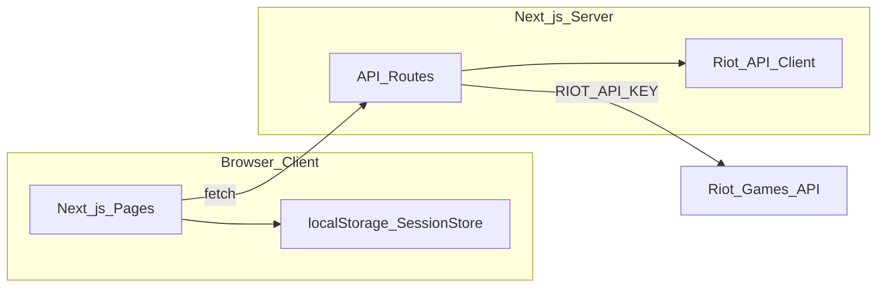
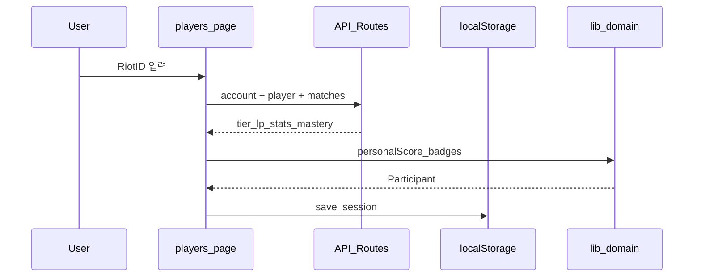
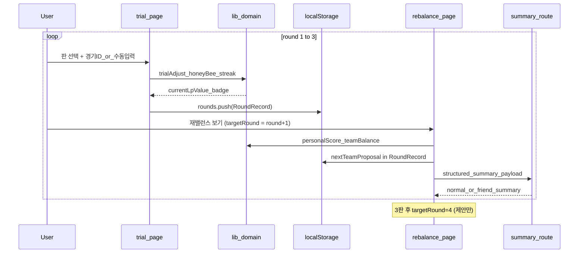

# 내전 총무 — 구현 계획

> **문서 버전:** v0.7  
> **기준 문서:** [constitution.md](./constitution.md), [spec.md](./spec.md) v1.2  
> **상태:** 검토 대기  
> **다음 단계:** 작업 정의 (`tasks.md`)

---

## 1. 목적

[spec.md](./spec.md)에 정의된 MVP v1.0을 **Next.js + TypeScript + SCSS**로 구현한다.  
본 문서는 **어떤 순서로, 어떤 구조로** 만들지 정한다. 개별 Task의 완료 조건·검증은 **작업 정의** 단계에서 분리한다.

### MVP 핵심 E2E

```
랜딩 → 세션 생성 → 8~10명 등록·전력 분석
  → 1판 팀 제안(수동 조정 가능)
  → 1판 시험 입력(경기 ID / 이미지 / 수동) → LP 누적·꿀벌 판정 → 2판 제안
  → 2판 시험 입력(경기 ID / 이미지 / 수동) → LP 누적·꿀벌 스트릭 → 3판 제안
  → 3판 시험 입력(경기 ID / 이미지 / 수동) → LP 누적·꿀벌 스트릭 → 4판 제안
  → AI 요약(normal / friend)
  (4판은 제안·수동 구성만, 시험 판 입력 없음)
```

---

## 2. 아키텍처 개요

### 2.1 시스템 구성



| 계층 | 역할 |
|------|------|
| **Client (App Router)** | UI, localStorage CRUD, 도메인 로직 호출(팀 배정·뱃지·LP는 클라이언트에서 실행 가능) |
| **API Routes** | Riot API 프록시, Key 보호, rate limit·에러 정규화 |
| **lib/** | 순수 TypeScript 도메인 로직 (명세 D-02~D-07) |
| **localStorage** | 세션·참가자·팀 제안·시험 판 결과 영구(브라우저 내) |

### 2.2 설계 원칙 (헌법 준수)

- 명세에 없는 기능 추가 금지
- Riot API Key는 **서버 환경 변수만** (`RIOT_API_KEY`)
- 도메인 로직은 UI와 분리 (`lib/`) — 동일 로직이 2곳 이상에서 쓰릴 때만 추상화
- 알고리즘·수식은 spec D-02, D-06, D-07과 1:1 대응

### 2.3 기술 스택

| 항목 | 선택 |
|------|------|
| 프레임워크 | Next.js 15 (App Router) |
| 언어 | TypeScript (strict) |
| 스타일 | SCSS Modules (`*.module.scss`) |
| 상태 | React state + localStorage (전역 상태 라이브러리 MVP 제외) |
| ID | `crypto.randomUUID()` |
| 배포 | Vercel 또는 Node 호스팅 (환경 변수로 Riot Key) |

### 2.4 디자인 시스템

UI 구현은 [design-system.md](./design-system.md)를 기준으로 한다.

- 컬러, 타이포, spacing, radius, shadow, glass surface 토큰은 `design-system.md`를 단일 기준으로 사용한다.
- Riot 클라이언트를 복제하지 않고, 문서에 정의된 `Hextech Glass` 스타일을 프로젝트 전반에 일관되게 적용한다.
- 공용 컴포넌트(`Button`, `Card`, `Badge`, `Panel`, `Tab`, `Input`)와 상태 표현(`OP`, `꿀벌`, `범인 후보`, info/warn/error`)은 디자인 시스템 토큰 위에 구성한다.
- 구현 시 스타일 값 하드코딩보다 SCSS 변수/믹스인 우선을 원칙으로 한다.

---

## 3. 프로젝트 구조 (목표)

```
team_gap/
├── documents/
│   ├── constitution.md
│   ├── spec.md
│   ├── design-system.md            # 디자인 토큰·컴포넌트 규칙
│   ├── implementation-plan.md      # 본 문서
│   └── tasks.md                    # 작업 정의
├── .env.local.example
├── package.json
├── next.config.ts
├── tsconfig.json
├── app/
│   ├── layout.tsx
│   ├── page.tsx                  # 랜딩 F-01
│   ├── globals.scss
│   ├── api/
│   │   └── riot/
│   │       ├── account/route.ts      # PUUID 조회
│   │       ├── player/route.ts       # Summoner + League + Mastery 일괄
│   │       ├── matches/route.ts      # 최근 20판 요약
│   │       └── match/[id]/route.ts   # 시험 판 경기 상세
│   │       └── vision/route.ts       # 점수판 이미지 분석 (OpenAI Vision)
│   │       └── summary/route.ts      # 텍스트 요약 (OpenAI)
│   │   └── ddragon/
│   │       └── bootstrap/route.ts    # version + championsByKey
│   └── session/
│       └── [id]/
│           ├── players/page.tsx      # F-02, F-03
│           ├── team/page.tsx         # F-04
│           ├── trial/page.tsx        # F-05
│           ├── rebalance/page.tsx    # F-06
│           └── summary/page.tsx      # F-08
├── components/
│   ├── layout/                   # StepNav, Header
│   ├── player/                   # PlayerCard, BadgeRow
│   ├── team/                     # TeamColumn, SwapControls
│   ├── trial/                    # TrialForm, MatchIdInput, ScoreboardImageUpload
│   └── shared/                   # ReasonPanel, TierEmblem, SynergyBadge, ProfileIcon, ChampionIcon, SummaryModeToggle
├── lib/
│   ├── types/                    # Session, Participant, ...
│   ├── storage/                  # localStorage CRUD
│   ├── riot/                     # 클라이언트 fetch 래퍼
│   │   └── ddragon/              # version/champion cache, image URL helpers
│   ├── constants/
│   │   ├── lpTable.ts            # 티어→LP 환산표
│   │   └── synergy.ts            # 시너지 임계값
│   ├── domain/
│   │   ├── winRate.ts            # F-03 보정 승률
│   │   ├── lp.ts                 # LP 환산·티어 역변환
│   │   ├── personalScore.ts      # D-06 개인 점수
│   │   ├── badges.ts             # OP, 1~4, 꿀벌
│   │   ├── teamBalance.ts        # D-06 라이벌·2^k 배정
│   │   ├── trialAdjust.ts        # D-02 70:30 LP 조정
│   │   ├── honeyBee.ts           # D-07
│   │   └── synergy.ts            # D-04 표시용
│   └── utils/
│       └── normalize.ts          # min-max 정규화
└── styles/                       # [design-system.md](./design-system.md) §7
    ├── abstracts/
    │   ├── _colors.scss
    │   ├── _typography.scss
    │   ├── _spacing.scss
    │   ├── _radius.scss
    │   ├── _shadows.scss
    │   ├── _breakpoints.scss
    │   ├── _mixins.scss
    │   └── _index.scss
    ├── base/
    │   ├── _reset.scss
    │   ├── _fonts.scss
    │   ├── _root.scss
    │   └── _accessibility.scss
    ├── utilities/
    │   ├── _glass.scss
    │   ├── _layout.scss
    │   └── _visually-hidden.scss
    └── globals.scss
```

---

## 4. 구현 단계 (Phase)

각 Phase는 **이전 Phase 완료 후** 진행을 권장한다. Phase 내 Task는 작업 정의에서 병렬 가능 여부를 표시한다.

### Phase 0 — 프로젝트 초기화

| 목표 | 산출물 |
|------|--------|
| Next.js + TS + SCSS 보일러플레이트 | 실행 가능한 `npm run dev` |
| 환경 변수 템플릿 | `.env.local.example` (`RIOT_API_KEY`, `DDRAGON_FALLBACK_VERSION`, `OPENAI_API_KEY`) |
| 기본 레이아웃·한국어 `lang` | `app/layout.tsx` |
| 디자인 시스템 토큰 뼈대 | `styles/abstracts/*`, `styles/base/*`, `styles/utilities/*`, `styles/globals.scss` ([design-system.md](./design-system.md) §7) |

**검증:** 빈 랜딩 페이지 로드, API Key 클라이언트 번들 미포함 확인.

---

### Phase 1 — 타입·저장소·랜딩 (F-01)

| 목표 | spec 매핑 |
|------|-----------|
| `lib/types` — spec §6 데이터 모델 | Session, Participant, RoundRecord, TeamProposal, TrialResult |
| `lib/storage/sessionStore.ts` — localStorage CRUD, 세션 목록 | D-01 |
| 랜딩: 새 내전 / 저장된 세션 목록 / 재진입 | F-01 |
| `app/session/[id]/players` 스켈레톤 + StepNav | §5 화면 구성 |

**검증:** 세션 생성·새로고침 후 유지·목록에서 재진입.

---

### Phase 2 — Riot API 서버 레이어

| API Route | Riot API | 용도 |
|-----------|----------|------|
| `GET /api/riot/account?riotId=` | Account V1 | PUUID (F-02) |
| `GET /api/riot/player?puuid=` | Summoner V4 + League V4 + Mastery V4 | 티어·LP·모스트·`profileIconId` (F-03) |
| `GET /api/riot/matches?puuid=` | Match V5 (목록 + 상세) | 최근 20판·주 포지션 (F-03, D-05) |
| `GET /api/riot/match/[id]` | Match V5 | 시험 판 (F-05) |
| `POST /api/riot/vision` | OpenAI Vision | 점수판 이미지 → 참가자명·KDA·딜량 초안 (F-09) |
| `POST /api/riot/summary` | OpenAI | 팀 제안·시험 판·재밸런스 텍스트 요약 (F-08) |
| `GET /api/ddragon/bootstrap` | Data Dragon CDN | version + champion key 매핑 (D-08) |

**구현 메모**

- 리전: **KR 고정** (`asia.api.riotgames.com` + `kr` routing)
- 솔로 우선·자유 폴백·언랭크 시 League entries 전체 조회 (D-03)
- Match: queueId 솔로/자유 우선 필터, 20판 제한
- **Rate limit:** 요청 간 짧은 delay 또는 429 시 retry 1회; 10명 순차 조회로 30초 목표 (spec §7)
- Data Dragon: `versions.json` 최신 버전 조회 후 **캐시**, 실패 시 `DDRAGON_FALLBACK_VERSION`
- `champion.json` (ko_KR)도 버전별 캐시, `championId` → Data Dragon `id` 매핑
- 이미지 URL은 `profileicon`, `champion`, `splash`, `loading`, `tier` helper로 생성
- Data Dragon 요청에는 **Riot API Key 미사용**
- OpenAI Vision: 점수판 이미지를 서버에서만 전송, 응답은 **초안 데이터**로만 사용
- Vision 결과는 자동 저장하지 않고, trial form에서 사용자 검토·수정 후 확정
- OpenAI Summary: 구조화 데이터만 입력, `normal` / `friend` 모드별 프롬프트 분리
- `normal` 모드 프롬프트는 **부정적 개인 평가 금지**, `friend` 모드는 장난성 코멘트 허용

**검증:** 서버에서만 Key 사용, 잘못된 Riot ID → 404/에러 메시지.

---

### Phase 3 — 도메인 로직 (lib/domain)

명세 알고리즘을 **순수 함수**로 구현. 단위 테스트 권장(작업 정의 단계).

| 모듈 | 명세 | 요약 |
|------|------|------|
| `constants/lpTable.ts` | D-03 | 티어+구간+LP → 환산값, 역변환 |
| `winRate.ts` | F-03 | `adjustedWinRate` |
| `personalScore.ts` | D-06 | 70/20/10, OP 2-pass, min-max |
| `badges.ts` | D-06 | OP +25%, 1~4 4분위 |
| `teamBalance.ts` | D-06 | 인접 페어링, 2^k 완전 탐색 |
| `trialAdjust.ts` | D-02 | KDA+딜량 기대치 대비 ±구간, **매 판** 70:30 누적 |
| `honeyBee.ts` | D-07 | preStat + tierExpect 이중 초과, 스트릭·뱃지, **기대 이하**(`roundBelowExpect`) |
| `synergy.ts` | D-04 | 높음/보통/낮음 (임계값 `constants/synergy.ts`) |
| `riot/ddragon/types.ts` | D-08 | `ChampionSummary`, `DataDragonImageUrls` |
| `riot/ddragon/version.ts` | D-08 | 최신 버전 조회, 캐시, fallback |
| `riot/ddragon/champions.ts` | D-08 | champion.json 캐시, key→id 매핑 |
| `riot/ddragon/urls.ts` | D-08 | profile, square, splash, loading, tier URL |

#### LP 환산표 (구현 상수 — v0.1 제안)

명세 예시 `골드 2 50LP → 1,850`에 맞춰 **구간당 100LP, 티어당 400LP** 스텝:

```
lpValue = tierBase[tier] + (4 - rankIndex) × 100 + lp
```

| 티어 | base |
|------|------|
| IRON | 0 |
| BRONZE | 400 |
| SILVER | 800 |
| GOLD | 1200 |
| PLATINUM | 1600 |
| EMERALD | 2000 |
| DIAMOND | 2400 |
| MASTER | 2800 |
| GRANDMASTER | 3100 |
| CHALLENGER | 3400 |

> 구현 시 `lpTable.ts`에 고정. 명세와 충돌 시 spec 먼저 수정.

#### 시너지 임계값 (구현 상수 — v0.1 제안)

| 등급 | 조건 (팀 5명 기준 예시) |
|------|-------------------------|
| 높음 | 포지션 겹침 0~1, 모스트 중복 ≤2 |
| 보통 | 포지션 겹침 2 |
| 낮음 | 포지션 겹침 3+ 또는 모스트 중복 4+ |

듀오 승률은 근거 패널 텍스트용; 등급은 포지션·챔피언 풀 가중.

**검증:** spec 시나리오 수치로 수동 테스트 (10명 mock 데이터).

---

### Phase 4 — 참가자 등록·전력 분석 (F-02, F-03)

| UI / 로직 | 내용 |
|-----------|------|
| Riot ID 입력·검색 | Account API → PUUID |
| 참가자 카드 | 프로필 아이콘, 티어 엠블럼, LoL 티어, OP/1~4 뱃지 |
| 백그라운드 분석 | player + matches API 병렬(순차 rate limit) |
| Data Dragon bootstrap | version + championsByKey 캐시 fetch |
| 언랭크 | 최근 시즌 폴백 → 수동 티어 입력 모달 |
| 근거 패널 (1차) | F-07 기본 컴포넌트 |
| 디자인 시스템 적용 | 카드, 배지, 폼, 토큰 기반 색상/타이포/간격 |

**검증:** spec F-02·F-03 수용 기준 체크리스트.

---

### Phase 5 — 1판 팀 제안 (F-04)

| UI / 로직 | 내용 |
|-----------|------|
| `teamBalance` 실행 | 8·10명만 활성 |
| 블루/레드 컬럼 | 드래그 또는 스왑 버튼 |
| 팀 지표 | 평균 티어, 구간 차이, 시너지 등급 |
| 멤버 추가/제거 | 1판 화면 인라인 (Riot ID 검색) |
| localStorage | `preTeamProposal` 저장 |

**검증:** 수동 스왑 시 지표 즉시 갱신, 7명일 때 제안 비활성.

---

### Phase 6 — 시험 판·재밸런스 (F-05, F-06) ★

| UI / 로직 | 내용 |
|-----------|------|
| 시험 판 입력 (1~3판) | 탭/스텝 UI, 경기 ID 자동 / 이미지 분석 / 수동(팀·승패·KDA·딜량) |
| `vision route` | 이미지 업로드 → 참가자명·KDA·딜량 초안 추출 |
| `trialAdjust` | **매 판** 70:30 LP 누적 → `currentLpValue` |
| `honeyBee` | **매 판** 꿀벌·기대 이하(`roundBelowExpect`) 판정, 스트릭·`honeyBeeBadge` |
| `rebalance` | `targetRound` 2·3·4, 갱신 personalScore로 `teamBalance` 재실행 |
| 비교 뷰 | 직전 판 vs 제안 판, 이동 인원, 티어 before→after, 꿀벌 등급 |
| localStorage | `rounds[]` CRUD (`RoundRecord`: trialResult, nextTeamProposal, lpSnapshot) |
| 4판 | F-06 제안·수동 구성만 (trial UI 없음) |

**검증:** spec §9 E2E — 경기 ID / 이미지 / 수동 입력, 1~3판 입력 + 4판 제안, LP 3회 누적, 무지개 꿀벌, 승패만 시 꿀벌 미판정.

---

### Phase 7 — AI 요약·근거 패널·마무리 (F-07, F-08, 릴리스)

| UI / 로직 | 내용 |
|-----------|------|
| `summary route` | 팀 제안/시험 판/재밸런스 구조화 데이터 → OpenAI 요약 |
| summary page | `normal` / `friend` 모드 토글, 세션·판별 요약 보기 |
| mode guardrails | `normal` 부정평가 금지, `friend` opt-in, 욕설·인신공격 금지 |
| ReasonPanel | 모든 분석 화면, 게임 용어만 |
| visual consistency | `design-system.md` 기준 badge/panel/toggle 시각 규칙 통일 |
| StepNav | 4단계 (players → team → trial → rebalance), 3클릭 이내 핵심 흐름 |
| 반응형 | 모바일·데스크톱 레이아웃 |
| 에러 UX | API 실패·부분 성공·rate limit 안내 |
| 수동 E2E 체크리스트 | spec §9 전항목 |

---

## 5. 데이터 흐름

### 5.1 참가자 등록·분석



### 5.2 시험 판 → 재밸런스 (1~3판 루프)



---

## 6. 환경·보안

| 변수 | 위치 | 설명 |
|------|------|------|
| `RIOT_API_KEY` | 서버 only | `.env.local`, Vercel env |
| `DDRAGON_FALLBACK_VERSION` | 서버/빌드 설정 | `versions.json` 실패 시 사용할 Data Dragon 버전 |
| `OPENAI_API_KEY` | 서버 only | OpenAI Vision(F-09) + 텍스트 요약(F-08) |
| `NEXT_PUBLIC_*` | 사용 안 함 (Key 노출 방지) |

- API Route에서만 `process.env.RIOT_API_KEY` 접근
- API Route에서만 `process.env.OPENAI_API_KEY` 접근
- 클라이언트는 `/api/riot/*`만 호출
- Data Dragon CDN 요청에는 별도 인증 헤더를 보내지 않음

---

## 7. 리스크·대응

| 리스크 | 대응 |
|--------|------|
| Riot rate limit (10명 × 다수 API) | 순차 호출 + delay; 진행률 UI; 실패 참가자만 재시도 |
| 점수판 OCR 오인식 | 사용자 확인 단계 필수, participant 수동 매핑·수정 UI |
| AI 요약 과한 표현 | `normal`/`friend` 프롬프트 분리, 부정평가 가드레일, 사용자 opt-in |
| 언랭크·이력 없음 | 수동 티어 UI (D-03) |
| localStorage 용량 | 세션 1건 ~수십KB; 초과 시 안내 (D-01) |
| Match ID 커스텀 게임 | KR match-v5; 참가자 매핑 불일치 시 수동 매핑 UI |
| LP 환산표와 실제 체감 차이 | MVP 후 spec·상수 조정 (명세 먼저) |

---

## 8. 명세 매핑表

| spec | Phase | 주요 산출물 |
|------|-------|-------------|
| F-01 | 1 | sessionStore, landing |
| F-02 | 4 | account route, 등록 UI |
| F-03 | 2, 3, 4 | player/matches routes, personalScore, badges, ddragon assets |
| F-04 | 3, 5 | teamBalance, team page |
| F-05 | 2, 6 | match route, trial page (1~3판), honeyBee streak |
| F-08 | 2, 7 | summary route, mode toggle, AI summary page |
| F-09 | 2, 6 | vision route, scoreboard upload, result review UI |
| F-06 | 3, 6 | trialAdjust 누적, rebalance page (2·3·4판) |
| F-07 | 4, 7 | ReasonPanel |
| D-01~D-07 | 3, 6 | lib/domain/* |
| D-08 | 2, 3, 4 | `lib/riot/ddragon/*`, bootstrap route, image components |
| design-system | 0, 4, 5, 7 | `design-system.md`, `styles/*`, shared UI components |

**MVP 제외:** RSO, Spectator

---

## 9. 완료 정의 (구현 계획)

- [ ] Phase 0~7 순서대로 구현 가능한 구조 확립
- [ ] spec §9 릴리스 수용 기준 전항목 수동 검증 가능
- [ ] `tasks.md`에 Phase별 Task 분해 완료 (다음 단계)

---

## 10. 변경 이력

| 버전 | 날짜 | 변경 |
|------|------|------|
| v0.1 | 2026-07-28 | 초안 — spec v0.7 기반 Phase 0~7, 구조, LP·시너지 상수 제안 |
| v0.2 | 2026-07-28 | spec v0.8 반영 — 3판 trial·4판 제안, rounds[], LP 누적, 꿀벌 스트릭, Phase 6·§5.2 확장 |
| v0.3 | 2026-07-28 | spec v0.9 반영 — D-08 Data Dragon, 버전·챔피언 캐시, profileIconId, bootstrap API, fallback env |
| v0.4 | 2026-07-28 | spec v1.0 반영 — F-09 OpenAI Vision MVP 필수, vision route, 이미지 확인 UI, `OPENAI_API_KEY` |
| v0.5 | 2026-07-28 | spec v1.1 반영 — F-08 OpenAI 요약 MVP 필수, normal/friend 모드, summary route/page, 부정평가 가드레일 |
| v0.6 | 2026-07-28 | `design-system.md` 연결 — Hextech Glass 토큰, shared UI 규칙, Phase 0/4/7 디자인 시스템 반영 |
| v0.7 | 2026-07-28 | spec v1.2 — D-07 기대 이하, SCSS 구조를 design-system.md §7과 동기화 |
