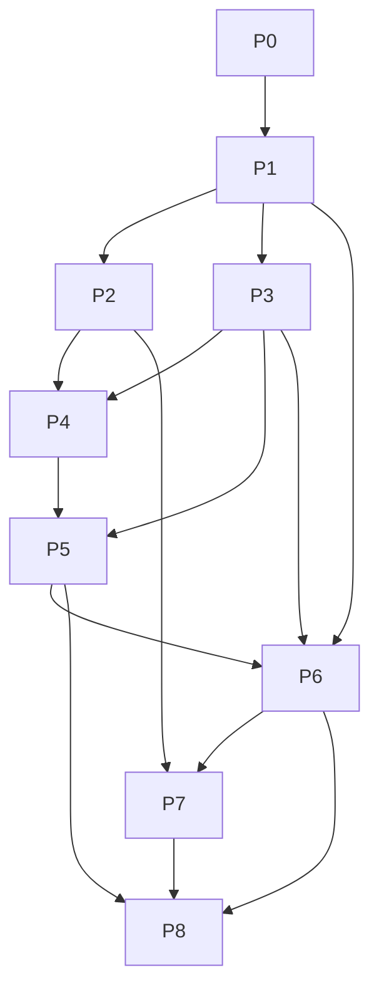

# 내전 총무 — 작업 정의

> **문서 버전:** v2.0.1  
> **기준 문서:** [constitution.md](./constitution.md), [spec.md](./spec.md) v3.0.2, [implementation-plan.md](./implementation-plan.md) v2.0.1, [design-system.md](./design-system.md) v0.5.1  
> **상태:** 3차 반복 — Phase 0~8 구현 완료 · P7-T07 수동 QA 잔여

---

## 사용법

| 표기 | 의미 |
|------|------|
| **병렬 가능** | 다른 Task와 동시 진행 가능 (의존성 없음) |
| **선행** | 완료 후에만 시작 |
| **검증** | 수동 또는 단위 테스트로 확인 |

Task ID: `P{Phase}-T{번호}` (예: `P6-T03`)

> **주의:** 모든 체크박스는 재구현 기준 **미완료** 상태다. 2차 구현 코드는 삭제되었으므로 새로 만든다.

---

## 2차 반복 신규/변경 Task 색인 (기능 기반, 유지)

| 주제 | Task |
|------|------|
| Gemini 제공자 (OpenAI 대체) | P0-T02, P2-T10, P2-T11 |
| 플로팅 어시스턴트 (요약 페이지 삭제) | P7-T01, P7-T02 |
| 성과 등급 F~OP | P3-T11 |
| `unrated` 기대치 산출 불가 | P3-T08, P4-T02 |
| 팀 전력 100분위 비율 | P3-T07, P5-T01 |
| 팀 컬럼 가독성(기본) | P5-T01 |
| 주 라인 아이콘 | P4-T06 |
| 참가자 간략 카드·본캐 경고 | P4-T03 |
| 시험 보조 모달·폼 상태 유지 | P6-T03, P6-T04 |
| 재밸런스 팀 중심·트레이드·증감 | P3-T13, P6-T07 |
| 내전 종료(마무리)·후원 | P7-T04, P7-T05 |

## 3차 반복 신규/변경 Task 색인 (모션·대시보드·대치, feedback "2차 시도")

| 주제 | Task |
|------|------|
| 모션 토큰·keyframes·reduced-motion | P0-T04, P8-T01 |
| 모션 래퍼 (단계 전환·순차 등장·팀 슬라이드 인) | P8-T02 |
| 상단 배너(중앙 로고)·소개형 랜딩 | P8-T03 |
| 대시보드·총무 프로필·세션 상태·별점 노출 | P8-T04, P8-T05 |
| 블루팀 우측 정렬 대치 (D-16) | P8-T06 |
| 팀 제안 개편 (하단 버튼·미니 모달·근거 hover) | P8-T07 |
| 참가자 등록 개편 (좌5/우5·안내 텍스트·hover 모달·CTA 그라디언트) | P8-T08 |
| 시험 판 개편 (판 탭 우상단·최근 경기 선택·종료 버튼 상시) | P8-T09 |
| 재밸런스 교체 border 강조·들어온/나간 표시 | P8-T10 |
| 마무리 강화 (승리팀 컬러·결과 칩·별점 1~5) | P8-T11 |

---

## Phase 0 — 프로젝트 초기화

### P0-T01. Next.js 보일러플레이트

**목적:** 실행 가능한 Next.js + TypeScript + SCSS 프로젝트 생성.

**완료 조건**

- [x] `npm run dev` 로 랜딩 페이지 로드
- [x] `app/layout.tsx` 한국어 `lang`
- [x] SCSS Modules 설정 (`*.module.scss`)
- [x] `app/globals.scss`에서 `styles/globals.scss` import

**검증:** 로컬 dev 서버 정상, 클라이언트 번들에 API Key 없음.

**병렬 가능:** P0-T02

---

### P0-T02. 환경 변수 템플릿 (Gemini)

**목적:** 서버 전용 API Key·fallback 설정 ([implementation-plan.md](./implementation-plan.md) §6).

**완료 조건**

- [x] `.env.local.example`에 다음 3개 변수:
  - `RIOT_API_KEY` — Riot Games API
  - `DDRAGON_FALLBACK_VERSION` — Data Dragon `versions.json` 실패 시 fallback 버전
  - `GEMINI_API_KEY` — Google Gemini 텍스트 요약(F-08) + 멀티모달 Vision(F-09)
- [x] `OPENAI_API_KEY`는 **사용하지 않음** (템플릿에 없음)
- [x] `NEXT_PUBLIC_*` 미사용

**검증:** `.env.local` 없이 dev 실행 시 API Route만 Key 요구. 코드 전역에 `OPENAI` 참조 없음.

**병렬 가능:** P0-T01

---

### P0-T03. 디자인 토큰 뼈대

**목적:** `design-system.md` §7 SCSS 구조와 토큰을 프로젝트에 반영한다.

**완료 조건**

- [x] `styles/abstracts/` — `_colors.scss`, `_typography.scss`, `_spacing.scss`, `_radius.scss`, `_shadows.scss`, `_breakpoints.scss`, `_mixins.scss`, `_index.scss`
- [x] `styles/base/` — `_reset.scss`, `_fonts.scss`, `_root.scss`, `_interactive.scss`, `_accessibility.scss`
- [x] `styles/utilities/` — `_glass.scss`, `_layout.scss`, `_visually-hidden.scss`
- [x] `styles/globals.scss` — abstracts·base·utilities import
- [x] `app/globals.scss`에서 `styles/globals.scss` 연결
- [x] color / typography / spacing / radius / shadow 핵심 토큰 정의
- [x] **블루/레드 팀 색 토큰**(가독성용) 정의 — 장식 과다 금지 (D-12)
- [x] 하드코딩 대신 토큰 우선 사용 원칙

**검증:** 주요 토큰·폴더 구조가 `design-system.md` §7과 1:1 대응.

**선행:** P0-T01

**병렬 가능:** P1-T01

---

### P0-T04. 모션 토큰·keyframes (D-14)

**목적:** `design-system.md` §4-A 모션 규칙(이징·지속시간·keyframes)을 SCSS 토큰으로 반영한다.

**완료 조건**

- [x] `styles/abstracts/_motion.scss` — `ease-in-out` 계열 cubic-bezier 토큰, 지속시간(220~420ms, stagger 40~80ms), hover 마이크로(150~250ms) 유지
- [x] keyframes: `fadeOut`, `fadeInUp`, `slideInLeft`, `slideInRight`, `gradientShift`
- [x] `_motion.scss`를 `styles/globals.scss`에 import
- [x] `@media (prefers-reduced-motion: reduce)` 전역 폴백(이동·루프 생략)
- [x] `lib/hooks/useReducedMotion.ts` 훅

**검증:** 토큰·keyframes가 `design-system.md` §4-A와 1:1 대응, reduced-motion에서 이동 모션 생략.

**선행:** P0-T03

---

## Phase 1 — 타입·저장소·랜딩 (F-01)

### P1-T01. 도메인 타입 정의 (spec §6, v3.0)

**목적:** v3.0 데이터 모델 TypeScript 타입.

**완료 조건**

- [x] `Session`, `Participant`, `RoundRecord`, `TeamProposal`, `TrialResult`, `TierDisplay`, `TeamChange`
- [x] `UserProfile`(displayName?·riotId?·myPuuid?) (D-15)
- [x] 세션 상태는 저장 필드 없이 데이터에서 파생 (D-15)
- [x] `Session.commentMode?: 'normal' | 'friend'`, `Session.wrapUp?: SessionWrapUp` (F-10)
- [x] `SessionWrapUp.winnerTeam?`, `performanceRating?: 1..5` (피드백 별점 없음, F-10/F-12)
- [x] `TeamProposal.bluePowerPct` / `redPowerPct` (D-12), `changes?: TeamChange[]`
- [x] `Participant.riotData.mainRole` 리터럴, `preMainRoleGames?` (D-07/D-13)
- [x] `trialPerformanceByRound`: `preStatScore/tierExpectScore: number | null`, `unrated`, `unratedReason`, `roundHoneyBee`, `roundBelowExpect`, `performanceGrade: 'F'|'D'|'C'|'B'|'A'|'OP'|null`
- [x] `personalScoreDeltaByRound?` (F-06)

**검증:** 타입이 spec §6 필드와 1:1 대응. 결측 필드는 `null`/`optional`(0 대체 금지).

**선행:** P0-T01

---

### P1-T02. localStorage 세션 CRUD

**목적:** D-01 세션 저장·목록·재진입 + `wrapUp` + 총무 프로필.

**완료 조건**

- [x] `lib/storage/sessionStore.ts` — create, get, list, update, delete
- [x] `wrapUp` 저장/갱신 지원 (F-10)
- [x] `lib/storage/userProfile.ts` — 총무 프로필(displayName·myPuuid) 읽기/쓰기 (D-15)
- [x] `lib/domain/sessionStatus.ts` — 세션 상태(preparing/in_progress/completed) 파생 (D-15)
- [x] 용량 초과 시 사용자 안내

**검증:** 새로고침 후 데이터 유지, 목록에서 재진입, 프로필·상태 파생.

**선행:** P1-T01

---

### P1-T03. 랜딩 페이지 (F-01)

**목적:** 소개형 랜딩 → 대시보드 진입 (세션 목록·생성은 대시보드 F-12/P8-T04).

**완료 조건**

- [x] 앱 소개 콘텐츠 + "시작하기" → `/dashboard` 이동
- [x] 상단 고정 배너(중앙 로고)는 공통 크롬(P8-T03)로 제공
- [x] (임시) 대시보드 구현 전에는 "새 내전 시작"으로 세션 생성 후 `/session/[id]/players` 이동 폴백 허용

**검증:** spec F-01 수용 기준(소개형·시작하기).

**선행:** P1-T02

---

### P1-T04. 세션 레이아웃·StepNav 스켈레톤

**목적:** §5 화면 네비게이션 기반.

**완료 조건**

- [x] players → team → trial → rebalance → **finish** 링크
- [x] **`/summary` 링크 없음** (AI는 플로팅 어시스턴트)
- [x] BackLink·PageHeader 공통 chrome
- [x] `app/session/[id]/players` 스켈레톤

**검증:** 세션 생성 후 StepNav 단계 표시.

**선행:** P1-T03

**병렬 가능:** P2-T01

---

## Phase 2 — Riot · Data Dragon · Gemini 서버 레이어

### P2-T01. Account API Route

**목적:** F-02 PUUID 조회.

**완료 조건**

- [x] `GET /api/riot/account?riotId=`
- [x] 무효 ID → 명확한 오류 메시지

**검증:** 유효/무효 Riot ID 수동 호출.

**선행:** P0-T02

**병렬 가능:** P2-T02 ~ P2-T04

---

### P2-T02. Account Search API Route (D-09)

**목적:** debounce 검색용 계정 목록 조회.

**완료 조건**

- [x] `GET /api/riot/account/search?q=`
- [x] `게임명#태그` exact 조회 → 0~1건
- [x] 게임명만 입력 시 KR1~KR5 순차 조회 → 0~5건
- [x] 2자 미만·불완전 태그 → 빈 배열

**검증:** 게임명 only / full Riot ID / 무효 입력 수동 호출.

**선행:** P2-T01

---

### P2-T03. Player API Route

**목적:** F-03 Summoner + League + Mastery.

**완료 조건**

- [x] `GET /api/riot/player?puuid=`
- [x] 솔로 우선, 자유 폴백, 언랭크 처리 (D-03)
- [x] Summoner `profileIconId` 응답 포함

**검증:** 랭크 있는 계정 티어·LP 반환.

**선행:** P0-T02

---

### P2-T04. Matches API Route (+표본 수)

**목적:** F-03 최근 20판, 주 포지션, 표본 수.

**완료 조건**

- [x] `GET /api/riot/matches?puuid=`
- [x] queueId 솔로/자유 우선, 20판 제한
- [x] 주 포지션 KDA·딜량과 **주 포지션 경기 수(`preMainRoleGames`)** 반환 (D-07 `unrated` 판정용)
- [x] 이력 없음 → 빈 결과를 명시적으로 표현 (0 대체 아님)

**검증:** 이력 있는/없는 계정 각각 표본 수 확인.

**선행:** P0-T02

---

### P2-T05. Match 상세 API Route

**목적:** F-05 시험 판 경기 ID 조회.

**완료 조건**

- [x] `GET /api/riot/match/[id]`
- [x] 참가자 puuid 매핑용 participant 데이터

**검증:** 커스텀 게임 matchId로 KDA·딜량 조회.

**선행:** P0-T02

---

### P2-T06. Rate limit·에러 정규화

**목적:** spec §7 30초·429 대응.

**완료 조건**

- [x] 요청 간 delay 또는 429 retry 1회
- [x] API Route 공통 에러 형식 (Riot·Gemini 공통)

**검증:** 10명 순차 조회 시 진행률·부분 실패 처리.

**선행:** P2-T01 ~ P2-T05

---

### P2-T07. Data Dragon 버전 조회·fallback

**목적:** D-08 최신 버전 1회 조회 + fallback.

**완료 조건**

- [x] `versions.json` 최신 버전 사용, 캐시
- [x] 실패 시 `DDRAGON_FALLBACK_VERSION`

**검증:** 실패 시 fallback 버전으로 URL 생성.

**선행:** P0-T02

**병렬 가능:** P2-T08

---

### P2-T08. 챔피언 데이터 조회·캐시

**목적:** D-08 ko_KR champion.json 캐시 + `championId` 매핑.

**완료 조건**

- [x] `champion.json` (ko_KR) 버전별 캐시
- [x] `key === championId` → `id` 매핑 (`103 → Ahri`)

**검증:** 숫자형 `championId`가 Data Dragon `id`로 변환.

**선행:** P2-T07

---

### P2-T09. Data Dragon URL 유틸 + bootstrap Route

**목적:** D-08 이미지 URL 생성 + 클라이언트 단일 버전 공유.

**완료 조건**

- [x] 프로필·챔피언 square/splash/loading·티어 엠블럼 URL
- [x] 한국어 이름·숫자형 id 직접 사용 금지
- [x] `GET /api/ddragon/bootstrap` → `{ version, championsByKey }`

**검증:** 클라이언트가 동일 버전으로 이미지 URL 생성.

**선행:** P2-T07, P2-T08

---

### P2-T10. Gemini Vision API Route (F-09)

**목적:** 점수판 이미지 분석을 Gemini 멀티모달로 서버 전용 제공.

**완료 조건**

- [x] `POST /api/riot/vision`
- [x] 이미지 업로드를 Gemini 멀티모달로 전달
- [x] 참가자명·KDA·딜량 초안 JSON 반환
- [x] `GEMINI_API_KEY` 서버 전용
- [x] 인식 실패·부분 실패 공통 에러 형식

**검증:** 샘플 점수판 이미지 → 수정 가능한 초안 응답.

**선행:** P0-T02

---

### P2-T11. Gemini 텍스트 요약 API Route (F-08)

**목적:** 팀/시험/재밸런스 구조화 데이터 요약을 Gemini로 제공.

**완료 조건**

- [x] `POST /api/riot/summary`
- [x] 구조화 payload 입력 (팀 평균·전력 비율·이동·꿀벌·성과 등급·unrated)
- [x] `normal` / `friend` 프롬프트 분리, 기본 `normal`
- [x] `normal` 부정 개인 평가 차단, `unrated`는 평가 대상 제외
- [x] `GEMINI_API_KEY` 서버 전용

**검증:** 동일 데이터에 normal/friend 톤 차이, unrated 미언급.

**선행:** P0-T02

---

## Phase 3 — 도메인 로직 (lib/domain)

### P3-T01. LP 환산표 (lpTable.ts)

**완료 조건**

- [x] `tierBase + (4 - rankIndex) × 100 + lp`
- [x] 역변환 `lpValue → TierDisplay`

**검증:** `골드 2 50LP → 1550` (base 1200 + (4−rankIndex)×100 + lp, rankIndex(II)=1 → 1200+300+50).

**선행:** P1-T01 · **병렬 가능:** P3-T02~

---

### P3-T02. 보정 승률 (winRate.ts)

**완료 조건**

- [x] `(wins + 20 × 0.5) / (games + 20)`

**검증:** 판수 0·20·100 케이스.

---

### P3-T03. min-max 정규화 유틸 (normalize.ts)

**목적:** D-06/D-07 정규화. **null 스킵**(0 대체 금지).

**완료 조건**

- [x] 입력 중 `null`/결측은 정규화 풀에서 제외
- [x] min == max이면 0.5

**검증:** 결측 포함 배열에서 결측이 0으로 취급되지 않음.

---

### P3-T04. 개인 점수 (personalScore.ts)

**완료 조건**

- [x] LP 70% + KDA 20% + 승률 10%
- [x] OP 2-pass, `currentLpValue` 입력 지원(재밸런스)

**검증:** mock 10명 점수.

**선행:** P3-T03

---

### P3-T05. OP·1~4 뱃지 (badges.ts)

**완료 조건**

- [x] OP ≥ 세션 평균 × 1.25
- [x] OP 제외 1~4 4분위

**검증:** spec D-06 표와 일치.

---

### P3-T06. 팀 밸런스 (teamBalance.ts)

**완료 조건**

- [x] 인접 라이벌 페어링, 2^k 완전 탐색
- [x] 8·10명 (n/2 vs n/2), `targetRound` optional

**검증:** 8·10명 mock, ideal 차이 최소.

---

### P3-T07. 팀 전력 비율 (powerRatio.ts, D-12)

**목적:** 두 팀 전력 합 → 합 100 상대 비율.

**완료 조건**

- [x] `bluePowerPct` / `redPowerPct`, 반올림 합 100 보정
- [x] 재밸런스 시 누적 LP 기반

**검증:** 512:488 → 51:49, 합 100.

**선행:** P3-T04

---

### P3-T08. 꿀벌 판정·스트릭 + `unrated` (honeyBee.ts, D-07)

**목적:** 매 판 판정 + 연속 등급 + **기대치 산출 불가 처리**.

**완료 조건**

- [x] `unrated` 판정: 표본<3, KDA/딜 결측, 기대치 null, 수동 티어만
- [x] `unrated`면 `roundHoneyBee`/`roundBelowExpect` false, **스트릭 유지**(증가·리셋 없음)
- [x] `roundHoneyBee` = trialScore > preStat AND > tierExpect (unrated 아닐 때만)
- [x] `roundBelowExpect` = 대칭 (`<=` 둘 다)
- [x] 1판: 사전 스탯 / 2·3판: 직전 LP 기반 기대
- [x] `updateStreak` → `none|bee|glitterBee|rainbowBee`, 미달 시 0 리셋
- [x] **기대치 결측 0 대체 금지**

**검증:** 이력 없는 mock → 꿀벌 미판정·스트릭 유지; 3연속 → rainbowBee; 미달 → 리셋.

**선행:** P3-T01, P3-T03

---

### P3-T09. 시험 판 LP 조정 (trialAdjust.ts)

**완료 조건**

- [x] 팀 LP 비율 기대치 대비 ±구간
- [x] 승패만 시 팀 단위 ±0.5구간
- [x] `applyTrialRound(prevLp, adjusted) → currentLpValue` (매 판 70:30)
- [x] 1판 prev=`preLpValue`, 2·3판 prev=직전 `currentLpValue`
- [x] `lpSnapshotAfterTrial`

**검증:** 3판 연속 누적 수치.

**선행:** P3-T01

---

### P3-T10. 시너지 등급 (synergy.ts)

**완료 조건**

- [x] 높음/보통/낮음 (임계값 `constants/synergy.ts`)

**검증:** mock 팀 5명 등급.

---

### P3-T11. 성과 등급 F~OP (performanceGrade.ts, D-11)

**목적:** 기대치 대비 6단계 등급, 표시 전용.

**완료 조건**

- [x] `r = trialScore / expectScore`, `expectScore = (preStat + tierExpect)/2`
- [x] 임계값 OP≥1.5 / A≥1.2 / B≥1.0 / C≥0.85 / D≥0.6 / F<0.6 (상수)
- [x] `unrated` 또는 기대치 null → 등급 `null`
- [x] 꿀벌/기대 이하와 모순 없음
- [x] 팀 배정·LP·personalScore에 영향 없음

**검증:** 등급 매핑 mock, unrated → null.

**선행:** P3-T08

---

### P3-T12. 개인 점수 증감 (F-06)

**목적:** 전판 대비 ▲/▼ n%.

**완료 조건**

- [x] `personalScoreDeltaByRound` 산출 (직전 판 대비 %)
- [x] 내부 점수 원값은 노출하지 않고 % 증감만

**검증:** 2·3·4판 각각 증감 계산.

**선행:** P3-T04

---

### P3-T13. 팀 트레이드 산출 (teamChange.ts, F-06)

**목적:** 직전 판 vs 제안 판 교체 인원 `A↔G`.

**완료 조건**

- [x] `TeamChange[]` (outPuuid, inPuuid, toTeam, reason)
- [x] 교체된 팀원 식별 (강조용 플래그 제공)

**검증:** mock 재배정에서 트레이드 목록.

**선행:** P3-T06

---

### P3-T14. Data Dragon 타입·근거 문구

**완료 조건**

- [x] `ChampionSummary`, `DataDragonImageUrls`
- [x] `reasonCopy.ts` — 게임 용어 근거 문장 (F-07, unrated 중립 문구 포함)

**검증:** url/version 유틸이 동일 타입 공유; 기술 용어 미노출.

**선행:** P1-T01

---

## Phase 4 — 참가자 등록·전력 분석 (F-02, F-03)

### P4-T01. 공용 UI 컴포넌트 스타일링

**완료 조건**

- [x] `Button`, `Card`, `Panel`, `Tab`, `Input`, `Modal` 시각 규칙
- [x] glass surface·border·shadow·radius 토큰
- [x] hover / focus / disabled 일관화

**검증:** 3개 이상 화면 재사용.

**선행:** P0-T03

---

### P4-T02. Riot ID 검색·등록 UI (F-02, D-09)

**완료 조건**

- [x] 게임명#태그 입력, 중복·2~10명 제한
- [x] debounce(400ms) 후 검색 API 호출
- [x] 로딩 → 목록 → 선택 상태 구분 UI
- [x] Enter / 추가 버튼 직접 등록 유지
- [x] 8·10명 미만 시 팀 제안 불가 안내 / 준비 완료 시 `n/10 · 팀 제안하기` CTA

**검증:** spec F-02·D-09 수용 기준.

**선행:** P2-T01, P2-T02, P1-T04, P4-T01

---

### P4-T03. 참가자 간략 카드·본캐 경고 (F-02)

**목적:** 등록 단계 가독성 (feedback).

**완료 조건**

- [x] 간략 카드: 닉#태그 + 프로필 아이콘 + 대표 티어 (상세는 접힘/아코디언)
- [x] "부캐라면 본캐 계정을 입력하세요" 경고 상시 노출

**검증:** 등록 목록에서 계정을 한눈에 확인, 상세 접힘.

**선행:** P4-T02

---

### P4-T04. 전력 분석 파이프라인 (+unrated)

**완료 조건**

- [x] player + matches 순차/진행률 UI
- [x] `preTier`, `preLpValue`, `currentLpValue`(=pre), 주라인 KDA·딜량·`preMainRoleGames`
- [x] 표본 부족·결측 시 **평가 불가(`unrated`) 플래그** 표시 (판정은 F-05)
- [x] `profileIconId`, 모스트 챔피언
- [ ] 언랭크 → 최근 시즌 → 수동 티어 모달

**검증:** 이력 없는 계정이 `기록 부족`으로 표시되고 0 대체 없음.

**선행:** P2-T03, P2-T04, P3-T04, P3-T05

---

### P4-T05. 참가자 카드·뱃지 UI

**완료 조건**

- [x] PlayerCard, BadgeRow, TierEmblem, ProfileIcon(placeholder), ChampionIcon, FallbackImage
- [x] OP/1~4 뱃지
- [x] design-system 토큰 적용

**검증:** 10명 카드 렌더.

**선행:** P4-T04, P2-T09, P3-T14

---

### P4-T06. 라인 아이콘 컴포넌트 (D-13)

**목적:** 주 라인을 텍스트 대신 아이콘으로.

**완료 조건**

- [x] 5개 라인(탑/정글/미드/원딜/서포터) 자체 인라인 SVG + 미확인 placeholder
- [x] `aria-label`·hover 툴팁 라인명
- [x] 비공식 에셋 크롤링·복제 금지
- [x] 참가자 카드·팀·시험·근거 패널에서 사용

**검증:** 라인별 아이콘 구분·접근성 라벨.

**선행:** P4-T05

---

### P4-T07. 근거 패널 (1차)

**완료 조건**

- [x] ReasonPanel — 티어·LP·승률, 게임 용어만, unrated 중립 문구

**검증:** API명·수식 미노출.

**선행:** P3-T14 · **병렬 가능:** P4-T05

---

## Phase 5 — 1판 팀 제안 (F-04)

### P5-T01. 1판 팀 제안 페이지 (가독성·비율)

**목적:** F-04 + D-12.

**완료 조건**

- [x] 8·10명만 활성
- [x] 블루/레드 컬럼 **가독성 있게 구분**(팀 색, 장식 과다 없이) — MVP 기본
- [x] 각 팀 **헤더에 평균 티어 첨부**
- [x] **전력 비율 막대 51% vs 49%** (D-12)
- [x] 스왑 시 평균·비율·시너지 실시간 갱신
- [x] `preTeamProposal` 저장

**검증:** spec F-04 수용 기준, 비율 합 100.

**선행:** P3-T06, P3-T07, P3-T10, P4-T04

---

### P5-T02. 1판 인라인 멤버 편집

**완료 조건**

- [x] Riot ID 검색 추가·팀원 제거, 등록 화면 강제 이동 없음

**검증:** 1판 화면에서 8→10명 변경 후 제안 갱신.

**선행:** P5-T01, P4-T02

---

### P5-T03. 상태 배지 시각 체계

**완료 조건**

- [x] OP/1~4/bee/glitterBee/rainbowBee, **성과 등급 F~OP**, **`기록 부족`(unrated)** 배지 규칙
- [x] `기록 부족`은 F 등급·미달과 시각적으로 구분
- [x] `friend` + `roundBelowExpect`일 때만 범인 후보 노출 (동작: Phase 6/7 배선)
- [x] normal/friend 시각 강도 차이 (동작: Phase 7 배선)

**검증:** 같은 상태가 화면마다 동일; unrated ≠ F.

**선행:** P4-T01, P4-T05

---

## Phase 6 — 시험 판·재밸런스 (F-05, F-06) ★

### P6-T01. rounds[] 저장소 API

**완료 조건**

- [x] `addRound`, `updateRound`, `getRound(n)`, length 0~3
- [x] Participant `currentLpValue`·honeyBee·grade 동기 갱신

**검증:** 3판 push 후 구조·새로고침 유지.

**선행:** P1-T02, P1-T01

---

### P6-T02. 시험 판 판 선택 UI (1~3판)

**완료 조건**

- [x] 1/2/3판 선택, 입력된 판 수정 가능
- [x] 다음 미입력 판 기본 포커스
- [x] **4판 입력 UI 없음**

**검증:** 3탭 전환, 4판 미표시.

**선행:** P6-T01, P1-T04

---

### P6-T03. 시험 판 수동 입력 + 폼 상태 유지 (F-05)

**목적:** 기본 입력(수동), 값 유실 방지 (feedback).

**완료 조건**

- [x] 직전 제안 팀 기본값 + 승리 팀(필수) + KDA·딜량(선택)
- [x] KDA/딜량 placeholder 예시 (`3.5` 또는 `12/4/9`, `20,170`)
- [x] 쉼표 천단위·소수점 파싱 (`parseStatNumber`)
- [x] **폼 값 state 유지** — 탭 전환·모달·재렌더에도 유실 없음
- [x] 승패만으로 저장 가능

**검증:** 값 입력 후 탭·모달 열었다 닫아도 유지; 승패만 저장 경로.

**선행:** P6-T02, P4-T01

---

### P6-T04. 보조 입력 모달 (경기 ID / 이미지, F-05/F-09)

**목적:** 보조 입력을 작은 버튼 + 모달로 (feedback).

**완료 조건**

- [x] 폼 상단에 **작은 보조 버튼** (경기 ID·이미지), 본문 폼 가리지 않음
- [x] 경기 ID 모달: 자동 매핑, 불일치 시 수동 매핑, KDA·딜량 수집
- [x] 이미지 모달: `POST /api/riot/vision` → 참가자 매핑
- [x] 모달 결과를 **메인 폼에 채우고** 닫음 (검토 전 자동 저장 금지)

**검증:** 두 경로 모두 결과가 메인 폼에 반영.

**선행:** P2-T05, P2-T10, P6-T03

---

### P6-T05. Vision 결과 검토·재매핑 (모달 내)

**완료 조건**

- [x] 인식된 참가자명·KDA·딜량을 행별 수정·재매핑
- [x] 오인식 있어도 수정 후 정상 진행

**검증:** 오인식 1~2개 수정 후 폼 반영.

**선행:** P6-T04

---

### P6-T06. 시험 판 완료 파이프라인

**목적:** 매 판 D-02 + D-07 + D-11 + RoundRecord.

**완료 조건**

- [x] `trialAdjust` 누적 → `currentLpValue`
- [x] `honeyBee`(+unrated) → streak·badge·history·`trialPerformanceByRound`
- [x] `performanceGrade` (unrated → null)
- [x] `RoundRecord { trialResult, lpSnapshotAfterTrial }`
- [x] `personalScore` 재계산, `personalScoreDeltaByRound`

**검증:** 3판 LP 누적, 스트릭 3→rainbow, 이력 없는 참가자 미판정·스트릭 유지.

**선행:** P3-T08, P3-T09, P3-T11, P3-T12, P6-T03 (또는 P6-T04/P6-T05)

---

### P6-T07. 재밸런스 페이지 — 팀 중심·트레이드 (F-06)

**목적:** targetRound 2·3·4, 팀 중심 UI.

**완료 조건**

- [x] `targetRound` 자동 또는 `?round=`, 1→2, 2→3, 3→4
- [x] **팀 중심** 레이아웃 (블루/레드 먼저, D-12 가독성·평균·비율 동일)
- [x] 팀원 카드에 직전 판 **성과 등급 F~OP**·꿀벌·티어 before→after
- [x] **트레이드 `A↔G`** 표시 + 교체 카드 **border 강조**
- [x] **개인 점수 증감 ▲/▼ n%**
- [x] `nextTeamProposal` 저장, 4판은 제안·수동만

**검증:** 2·4판 화면, 트레이드·증감·등급 표시.

**선행:** P6-T06, P3-T06, P3-T07, P3-T13, P4-T05

---

### P6-T08. 재밸런스 수동 조정

**완료 조건**

- [x] 스왑·수동 팀 구성, 지표 실시간 갱신
- [x] `nextTeamProposal` 갱신 저장

**검증:** 4판 수동 스왑 후 저장.

**선행:** P6-T07

---

### P6-T09. StepNav·흐름 연결 (multi-round)

**완료 조건**

- [x] 1판 trial → rebalance round=2, 2·3판 동일
- [x] 3판 trial → rebalance round=4
- [x] 중간 종료 가능 (시나리오 C) + 언제든 `/finish` 진입 (StepNav 상시 노출)

**검증:** spec §9 E2E 흐름.

**선행:** P6-T06, P6-T07, P1-T04

---

## Phase 7 — AI 어시스턴트·마무리·폴리시 (F-07~F-11)

### P7-T01. 플로팅 어시스턴트 컴포넌트 (D-10)

**목적:** 요약 페이지 없이 플로팅으로 AI 요약 제공.

**완료 조건**

- [x] 우측 하단 원형 캐릭터 + "설명을 들어보세요" 말풍선 힌트
- [x] team / trial / rebalance 화면에 공통 마운트, 콘텐츠 가리지 않음
- [x] 클릭 시 맥락 요약 말풍선, 말풍선 내 normal/friend 토글 (기본 normal)
- [x] **`/summary` 페이지 없음**

**검증:** 세 화면에서 플로팅으로 요약 접근, 독립 페이지 부재.

**선행:** P2-T11, P5-T01, P6-T07

---

### P7-T02. AI 요약 연동·가드레일

**완료 조건**

- [x] 구조화 payload(팀 평균·비율·이동·꿀벌·등급) → `POST /api/riot/summary`
- [x] 팀 화면 요약에 **팀 색(블루/레드) 멘트** 포함
- [x] `friend` 명시적 opt-in, 욕설·인신공격 금지
- [x] `normal` 부정 개인 평가 비노출
- [x] **`unrated` 참가자는 기대 이상/이하·범인 후보 제외**, 중립 문구만

**검증:** normal/friend 톤 차이, unrated 미언급, 팀 색 멘트.

**선행:** P7-T01

---

### P7-T03. ReasonPanel 전 화면 통합 (F-07)

**완료 조건**

- [x] F-03~F-06 모든 화면 접근
- [x] 꿀벌 스트릭·성과 등급·70:30 누적·`기록 부족` 근거 문구
- [x] 기술 용어 미노출

**검증:** 모든 분석 화면 근거 접근.

**선행:** P4-T07, P6-T07

---

### P7-T04. 내전 종료 · 마무리 페이지 (F-10)

**목적:** `/session/[id]/finish` 총합 결과·평가·피드백.

**완료 조건**

- [x] 판별 요약(승패·성과 등급·꿀벌), 참가자 사전→최종 티어 변화·증감
- [x] 세션 하이라이트 + 어시스턴트 총평
- [x] (선택) MVP·평가·피드백 입력 → `wrapUp` 저장
- [x] 어떤 판 수에서 종료해도 동작

**검증:** 진행 판까지 요약, 평가·피드백 저장.

**선행:** P1-T02, P6-T06, P7-T01

---

### P7-T05. 개발자 후원 (F-11)

**완료 조건**

- [x] 마무리 화면 "개발자 커피 사주기" 영역
- [x] 계좌번호 복사 버튼 / 후원 링크 (`constants/donation.ts`)
- [x] 핵심 흐름 방해 없음

**검증:** 계좌 복사·링크 이동.

**선행:** P7-T04

---

### P7-T06. 반응형·에러 UX

**완료 조건**

- [x] 모바일·데스크톱 레이아웃
- [x] Riot/Gemini 실패·rate limit·부분 성공 안내

**검증:** 모바일 viewport 수동 확인.

**병렬 가능:** P7-T03

---

### P7-T07. 릴리스 수용 기준 체크리스트

**목적:** spec §9 MVP v3.0 · [release-checklist.md](./release-checklist.md).

**완료 조건**

- [x] `release-checklist.md`를 v3.0 기준으로 갱신 (모션·대시보드·대치·최근 경기 선택·별점 포함)
- [ ] §9 전항목 수동 검증 문서화
- [ ] 3판 LP 누적·무지개 꿀벌·4판 제안 확인 (수동 QA)
- [ ] 이전 기록 없는 참가자 꿀벌·등급 미판정 확인 (수동 QA)
- [ ] `normal` 부정평가 금지 / `friend` opt-in 확인 (수동 QA)

**검증:** implementation-plan §9 완료 정의.

**선행:** P6-T09, P7-T02, P7-T04, P7-T05, P8 전체

---

## Phase 8 — 3차 UX: 모션·대시보드·대치·마무리 강화 (D-14~D-16, F-01/F-12, feedback "2차 시도")

> Phase 0~7 기능 기반 위에 UX·모션·정보 구조를 덧입힌다. 모션 토큰(P0-T04)이 선행된다.

### P8-T01. 모션 유틸·전역 규칙 (D-14)

**완료 조건**

- [x] P0-T04 토큰 기반, 공통 진입/퇴장 유틸 클래스·믹스인 정리
- [x] `useReducedMotion` 연동 규칙 문서화(코드 주석·design-system 참조)
- [x] hover 마이크로(150~250ms)와 전환(220~420ms) 구분 유지

**검증:** 토큰만으로 페이드/슬라이드/stagger 재사용 가능.

**선행:** P0-T04

---

### P8-T02. 모션 래퍼 컴포넌트 (D-14)

**완료 조건**

- [x] `components/motion/FadeStage` — 단계 전환 시 이전 박스 페이드 아웃
- [x] `components/motion/Stagger` — 박스 → 타이틀 → 리스트/콘텐츠 순차 등장
- [x] `components/motion/TeamSlideIn` — 블루 좌→우 / 레드 우→좌 슬라이드 인(등록 화면 제외)
- [x] `prefers-reduced-motion`에서 이동·루프 생략, 즉시 표시

**검증:** 각 화면에서 순차 등장·팀 슬라이드 인 동작, reduced-motion 폴백.

**선행:** P8-T01

---

### P8-T03. 상단 배너·소개형 랜딩 (F-01, D-14)

**완료 조건**

- [x] `components/layout/TopBanner` — 고정 상단, 중앙 정렬 로고
- [x] 랜딩을 큰 버튼 대신 소개형으로 재구성, "시작하기" → `/dashboard`
- [x] 공통 크롬으로 배너 유지(세션 화면 포함)

**검증:** spec F-01 수용 기준.

**선행:** P1-T03, P8-T02

---

### P8-T04. 대시보드 페이지 (F-12, D-15)

**완료 조건**

- [x] `app/dashboard/page.tsx` — "안녕하세요, 총무 {이름}님" 인사(미지정 시 일반 문구)
- [x] `components/dashboard/SessionGrid`·`SessionCard` — 그리드 카드(세션명·생성일·상태 칩·내 평점)
- [x] 카드 클릭 시 세션 적절 단계 재진입, "새 내전 시작" 세션 생성
- [x] 카드 나열에 Stagger 모션 적용

**검증:** spec F-12 수용 기준.

**선행:** P1-T02, P8-T02

---

### P8-T05. 내 플레이어 지정 (D-15)

**완료 조건**

- [x] `components/dashboard/MyPlayerPicker` — Riot ID 검색 결과 계정을 "나"(myPuuid)로 지정/해제
- [x] 지정 시 인사말 이름 반영, `userProfile`에 저장
- [x] 미지정 시 일반 문구 폴백

**검증:** 지정/해제 후 인사말·프로필 반영.

**선행:** P8-T04

---

### P8-T06. 팀 대치 정렬 (D-16)

**완료 조건**

- [x] 좌 블루/우 레드 컬럼 위치 유지, `TeamColumn` 블루 내용 우측·레드 내용 좌측 정렬
- [x] 팀 제안·재밸런스·게임 결과 공통 적용
- [x] 팀원 카드가 두 팀 모두 팀 박스 안쪽 폭 100% 유지 (`teamList` grid에 `justify-content` 사용 금지, 정렬은 `text-align`으로)
- [x] 블루팀 카드 내 요소 거울 순서 — `playerCard`·`badges` 모두 `row-reverse`로 티어 뱃지·라인 아이콘 순서 반전
- [x] 모바일 세로 스택 시 정렬·순서 미러링 모두 해제(가독성 우선)
- [x] 배정 로직·데이터 불변 확인

**검증:** spec D-16 수용 기준.

**선행:** P5-T01

---

### P8-T07. 팀 제안 화면 개편 (F-04)

**완료 조건**

- [x] 시험 판 진행 버튼을 팀 분석 **하단 버튼 구역**으로 이동
- [x] `components/team/MiniAddModal` — 팀 박스 버튼 클릭 시 블루=좌/레드=우 플로팅 추가 모달
- [x] `components/team/BalanceReasonPopover` — 우상단 아이콘 hover 시 상세 근거 플로팅
- [x] 팀원 카드 TeamSlideIn 적용

**검증:** spec F-04 수용 기준.

**선행:** P5-T01, P8-T02, P8-T06

---

### P8-T08. 참가자 등록 화면 개편 (F-02)

**완료 조건**

- [x] 안내 문구를 박스 밖 검색창 상단 소형 텍스트로 이동(본캐 경고 포함)
- [x] 등록 카드 ~50% 축소, 좌5/우5 2열, 좌열→우열 순차 채움, 한 화면 노출
- [x] `components/player/PlayerHoverCard` — hover 시 상세 플로팅 모달(아코디언 대체)
- [x] 팀 제안 CTA 활성화 시 그라디언트 애니메이션(gradientShift)

**검증:** spec F-02 수용 기준.

**선행:** P4-T03, P8-T02

---

### P8-T09. 시험 판 화면 개편 (F-05)

**완료 조건**

- [x] 판 선택 탭(1·2·3판) 우측 상단 고정
- [x] 블루팀 멤버 카드·입력 행 우측 정렬(D-16), TeamSlideIn
- [x] `components/trial/RecentMatchesModal` — 현재 세션에 내 플레이어가 있으면 우선 사용, 없으면 참가자 선택. 최근 경기 목록(matches API)에서 경기 선택 → 팀 구성·승패·KDA·딜량 자동 채움, 불일치 수동 매핑
- [x] "내전 종료하기" 버튼 상시 제공(4판 전에도)

**검증:** spec F-05 수용 기준(최근 경기 선택·종료 버튼).

**선행:** P6-T03, P6-T05, P8-T06

---

### P8-T10. 재밸런스 교체 강조 (F-06)

**완료 조건**

- [x] 교체 팀원 카드 border 강조
- [x] 강조 카드에 들어온/나간(어느 팀에서) 표시
- [x] `A ↔ G` 트레이드 표기와 연동

**검증:** spec F-06 수용 기준.

**선행:** P6-T07, P8-T06

---

### P8-T11. 마무리 화면 강화 (F-10, F-12)

**완료 조건**

- [x] 최다 승 승리팀 판정(동률 시 마지막 판 승자) → 대표 박스를 팀 컬러로 강조
- [x] 판별 결과를 팀 컬러 강조 칩으로 표시
- [x] `components/shared/StarRating` — 성과 별점 1~5 하나 입력, 피드백은 텍스트만
- [x] 성과 별점을 `wrapUp`에 저장하고 대시보드 카드 "내 평점"에 반영

**검증:** spec F-10 수용 기준, 대시보드 평점 연동.

**선행:** P7-T04, P8-T04

---

## 의존성 요약

**크리티컬 경로:** P0 → P0-T03/T04 → P1 → P3(P3-T08·T11) → P4-T01 → P5-T01 → P6(T03~T07) → P7-T01·T02 → P7-T04 → **P8(T02→T04/T06→T07~T11)** → P7-T07

---

## 변경 이력

| 버전 | 날짜 | 변경 |
|------|------|------|
| v0.1~v0.7 | 2026-07-28~29 | 1차 반복 Task 분해·구현 체크 (spec v1.x, 이후 코드 삭제) |
| v1.0 | 2026-07-29 | **2차 반복 재구현 Task 전면 재작성** (spec v2.1.1 / plan v1.0.1). 전 Task 미완료 리셋. Gemini(P0-T02/P2-T10/T11)·플로팅 어시스턴트(P7-T01/T02)·성과 등급(P3-T11)·`unrated`(P3-T08/P4-T04)·전력 비율(P3-T07/P5-T01)·라인 아이콘(P4-T06)·간략 카드·본캐 경고(P4-T03)·보조 모달·폼 유지(P6-T03/T04)·트레이드·증감(P3-T12/T13/P6-T07)·마무리·후원(P7-T04/T05) 신설. `/summary`·OpenAI 제거 |
| v1.1 | 2026-07-29 | **Phase 7 구현 완료.** 플로팅 어시스턴트(🐝, team/trial/rebalance/finish)·summaryPayload 빌더(unrated 서버 필터)·normal/friend 가드레일·시험 판 ReasonPanel(70:30·꿀벌·기록 부족)·`/finish` 마무리 페이지(판별 결과·티어 변화·하이라이트·wrapUp·총평)·개발자 후원(`constants/donation.ts`·계좌 복사)·release-checklist v2.1 갱신. lint·build 통과. P7-T07 수동 QA 항목만 잔여 |
| v1.2 | 2026-07-29 | QA 중 Gemini 신규 키에서 `gemini-2.5-flash` 계열 호출 제한 확인. spec/plan에 "무료 tier에서 실제 호출 가능한 최신 flash 계열 사용" 및 키 거부(401/403) 안내 정규화 메모 추가 |
| v2.0.1 | 2026-07-30 | P8-T06 완료 조건 보강(구현 피드백): 팀원 카드 폭 100% 유지 규칙(`teamList` grid에 `justify-content` 금지), 블루팀 뱃지 행까지 `row-reverse` 거울 순서, 모바일 미러링 해제 |
| v2.0 | 2026-07-29 | **3차 반복 재구현 Task** (spec v3.0 / plan v2.0). 2차 코드 삭제로 전 Task 미완료 리셋. **Phase 8 신설**(P8-T01~T11): 모션 유틸·래퍼(D-14), 상단 배너·소개형 랜딩(F-01), 대시보드·내 플레이어(F-12/D-15), 대치 정렬(D-16), 팀 제안 개편(F-04), 참가자 등록 개편(F-02), 시험 판 개편·최근 경기 선택(F-05), 재밸런스 교체 강조(F-06), 마무리 강화·별점(F-10). P0-T04 모션 토큰, P1-T01/T02 UserProfile·status·별점 타입/저장 추가 |
