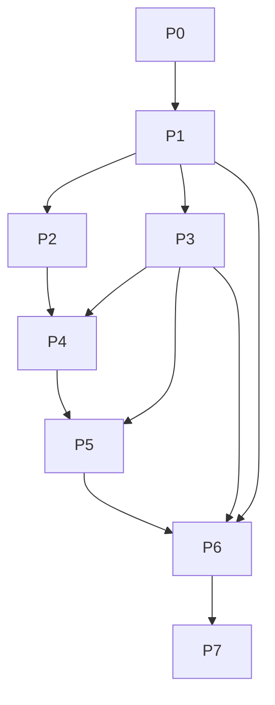

# 내전 총무 — 작업 정의

> **문서 버전:** v0.4  
> **기준 문서:** [constitution.md](./constitution.md), [spec.md](./spec.md) v1.2, [implementation-plan.md](./implementation-plan.md) v0.7, [design-system.md](./design-system.md)  
> **상태:** 구현 착수 가능

---

## 사용법

| 표기 | 의미 |
|------|------|
| **병렬 가능** | 다른 Task와 동시 진행 가능 (의존성 없음) |
| **선행** | 완료 후에만 시작 |
| **검증** | 수동 또는 단위 테스트로 확인 |

Task ID: `P{Phase}-T{번호}` (예: `P6-T03`)

---

## Phase 0 — 프로젝트 초기화

### P0-T01. Next.js 보일러플레이트

**목적:** 실행 가능한 Next.js + TypeScript + SCSS 프로젝트 생성.

**완료 조건**

- [x] `npm run dev` 로 랜딩 페이지 로드
- [x] `app/layout.tsx` 한국어 `lang`
- [x] SCSS Modules 설정 (`*.module.scss`)
- [x] `app/globals.scss`에서 `styles/globals.scss` import

**검증:** 로컬 dev 서버 정상, 클라이언트 번들에 API Key 없음.

**병렬 가능:** P0-T02

---

### P0-T02. 환경 변수 템플릿

**목적:** 서버 전용 API Key·fallback 설정 ([implementation-plan.md](./implementation-plan.md) §6).

**완료 조건**

- [x] `.env.local.example`에 다음 3개 변수:
  - `RIOT_API_KEY` — Riot Games API
  - `DDRAGON_FALLBACK_VERSION` — Data Dragon `versions.json` 실패 시 fallback 버전
  - `OPENAI_API_KEY` — OpenAI Vision(F-09) + 텍스트 요약(F-08)
- [x] `NEXT_PUBLIC_*` 미사용

**검증:** `.env.local` 없이 dev 실행 시 API Route만 Key 요구.

**병렬 가능:** P0-T01

---

### P0-T03. 디자인 토큰 뼈대

**목적:** `design-system.md` §7 SCSS 구조와 토큰을 프로젝트에 반영한다.

**완료 조건**

- [x] `styles/abstracts/` — `_colors.scss`, `_typography.scss`, `_spacing.scss`, `_radius.scss`, `_shadows.scss`, `_breakpoints.scss`, `_mixins.scss`, `_index.scss`
- [x] `styles/base/` — `_reset.scss`, `_fonts.scss`, `_root.scss`, `_accessibility.scss`
- [x] `styles/utilities/` — `_glass.scss`, `_layout.scss`, `_visually-hidden.scss`
- [x] `styles/globals.scss` — abstracts·base·utilities import
- [x] `app/globals.scss`에서 `styles/globals.scss` 연결
- [x] color / typography / spacing / radius / shadow 핵심 토큰 정의 (`design-system.md` §2~§6)
- [x] 하드코딩 대신 토큰 우선 사용 원칙 문서화

**검증:** 주요 토큰·폴더 구조가 `design-system.md` §7과 1:1 대응한다.

**선행:** P0-T01

**병렬 가능:** P1-T01

---

## Phase 1 — 타입·저장소·랜딩 (F-01)

### P1-T01. 도메인 타입 정의 (spec §6)

**목적:** v0.8 데이터 모델 TypeScript 타입.

**완료 조건**

- [x] `Session`, `Participant`, `RoundRecord`, `TeamProposal`, `TrialResult`, `TierDisplay`
- [x] `honeyBeeBadge`, `honeyBeeStreak`, `honeyBeeHistory`, `currentLpValue`
- [x] `trialPerformanceByRound` 내 `roundHoneyBee`, `roundBelowExpect` (D-07)
- [x] `Session.commentMode?: 'normal' | 'friend'` (F-08)
- [x] `rounds[]` 배열 (단일 `trialResult` / `rebalanceProposal` 없음)

**검증:** 타입이 spec §6 필드와 1:1 대응.

**선행:** P0-T01

---

### P1-T02. localStorage 세션 CRUD

**목적:** D-01 세션 저장·목록·재진입.

**완료 조건**

- [x] `lib/storage/sessionStore.ts` — create, get, list, update, delete
- [x] 용량 초과 시 사용자 안내

**검증:** 새로고침 후 데이터 유지, 목록에서 재진입.

**선행:** P1-T01

---

### P1-T03. 랜딩 페이지 (F-01)

**목적:** 새 내전 / 저장된 세션 목록.

**완료 조건**

- [x] "새 내전 시작" → UUID 세션 생성 → `/session/[id]/players` 이동
- [x] 저장된 세션 카드 목록·재진입

**검증:** spec F-01 수용 기준.

**선행:** P1-T02

---

### P1-T04. StepNav 스켈레톤

**목적:** §5 화면 네비게이션 기반.

**완료 조건**

- [x] players → team → trial → rebalance 4단계 링크
- [x] `app/session/[id]/players` 스켈레톤 페이지

**검증:** 세션 생성 후 StepNav 4단계 표시.

**선행:** P1-T03

**병렬 가능:** P2-T01 (Phase 2)

---

## Phase 2 — Riot API 서버 레이어

### P2-T01. Account API Route

**목적:** F-02 PUUID 조회.

**완료 조건**

- [ ] `GET /api/riot/account?riotId=`
- [ ] 무효 ID → 명확한 오류 메시지

**검증:** 유효/무효 Riot ID 수동 호출.

**선행:** P0-T02

**병렬 가능:** P2-T02, P2-T03, P2-T04

---

### P2-T02. Player API Route

**목적:** F-03 Summoner + League + Mastery.

**완료 조건**

- [ ] `GET /api/riot/player?puuid=`
- [ ] 솔로 우선, 자유 폴백, 언랭크 처리 (D-03)
- [ ] Summoner `profileIconId`를 응답에 포함

**검증:** 랭크 있는 계정 티어·LP 반환.

**선행:** P0-T02

---

### P2-T03. Matches API Route

**목적:** F-03 최근 20판, 주 포지션.

**완료 조건**

- [ ] `GET /api/riot/matches?puuid=`
- [ ] queueId 솔로/자유 우선, 20판 제한

**검증:** KDA·딜량·주 포지션 필드 포함.

**선행:** P0-T02

---

### P2-T04. Match 상세 API Route

**목적:** F-05 시험 판 경기 ID 조회.

**완료 조건**

- [ ] `GET /api/riot/match/[id]`
- [ ] 참가자 puuid 매핑용 participant 데이터

**검증:** 커스텀 게임 matchId로 KDA·딜량 조회.

**선행:** P0-T02

---

### P2-T05. Rate limit·에러 정규화

**목적:** spec §7 30초·429 대응.

**완료 조건**

- [ ] 요청 간 delay 또는 429 retry 1회
- [ ] API Route 공통 에러 형식

**검증:** 10명 순차 조회 시 진행률·부분 실패 처리.

**선행:** P2-T01 ~ P2-T04

---

### P2-T06. Data Dragon 버전 조회·fallback

**목적:** D-08 최신 Data Dragon 버전 1회 조회 + fallback.

**완료 조건**

- [ ] `GET https://ddragon.leagueoflegends.com/api/versions.json`
- [ ] 배열 첫 항목을 최신 버전으로 사용
- [ ] 서버 또는 애플리케이션 레벨 캐시
- [ ] 실패 시 `DDRAGON_FALLBACK_VERSION` 사용

**검증:** `versions.json` 실패 시 fallback 버전으로 URL 생성.

**선행:** P0-T02

**병렬 가능:** P2-T07

---

### P2-T07. 챔피언 데이터 조회·캐시

**목적:** D-08 한국어 champion.json 캐시 + `championId` 매핑.

**완료 조건**

- [ ] `GET /cdn/{version}/data/ko_KR/champion.json`
- [ ] `key === championId` 기준 매핑
- [ ] 버전별 캐시 및 버전 변경 시 무효화
- [ ] `103 -> Ahri` 같은 key→id 변환 지원

**검증:** 숫자형 `championId`가 Data Dragon 문자열 `id`로 변환된다.

**선행:** P2-T06

---

### P2-T08. Data Dragon URL 유틸

**목적:** D-08 프로필·챔피언·티어 이미지 URL 생성.

**완료 조건**

- [ ] 프로필 아이콘 URL 생성
- [ ] 챔피언 square / splash / loading URL 생성
- [ ] 티어 엠블럼 URL 생성
- [ ] 한국어 이름·숫자형 `championId`를 URL에 직접 사용하지 않음

**검증:** `103`은 `Ahri.png`로, 오공은 Data Dragon 내부 `id` 기준으로 생성.

**선행:** P2-T07

---

### P2-T09. Data Dragon bootstrap API Route

**목적:** 클라이언트가 앱 전역 단일 버전·챔피언 매핑을 공유하도록 초기 데이터 제공.

**완료 조건**

- [ ] `GET /api/ddragon/bootstrap`
- [ ] `{ version }` 반환
- [ ] 필요 시 `{ championsByKey }` 경량 맵 반환

**검증:** 클라이언트에서 동일 버전으로 프로필·챔피언·티어 이미지 URL 생성.

**선행:** P2-T06, P2-T07, P2-T08

---

### P2-T10. OpenAI Vision API Route

**목적:** F-09 점수판 이미지 분석을 서버 전용 API로 제공한다.

**완료 조건**

- [ ] `POST /api/riot/vision`
- [ ] 이미지 업로드를 OpenAI Vision으로 전달
- [ ] 참가자명, KDA, 딜량 초안 JSON 반환
- [ ] API Key는 서버 환경 변수 `OPENAI_API_KEY`로만 사용
- [ ] 인식 실패·부분 실패 공통 에러 형식 정의

**검증:** 샘플 점수판 이미지 업로드 시 수정 가능한 초안 응답 반환.

**선행:** P0-T02

---

## Phase 3 — 도메인 로직 (lib/domain)

### P3-T01. LP 환산표 (lpTable.ts)

**목적:** D-03 티어 ↔ LP 환산값.

**완료 조건**

- [ ] `tierBase + rankIndex × 100 + lp` (implementation-plan §4 상수)
- [ ] 역변환 `lpValue → TierDisplay`

**검증:** `골드 2 50LP → 1850` 수동 테스트.

**선행:** P1-T01

**병렬 가능:** P3-T02 ~ P3-T08

---

### P3-T02. 보정 승률 (winRate.ts)

**목적:** F-03 `adjustedWinRate`.

**완료 조건**

- [ ] `(wins + 20 × 0.5) / (games + 20)`

**검증:** 판수 0·20·100 케이스.

---

### P3-T03. 개인 점수 (personalScore.ts)

**목적:** D-06 LP 70% + KDA 20% + 승률 10%.

**완료 조건**

- [ ] min-max 정규화
- [ ] `currentLpValue` 입력 지원 (재밸런스용)

**검증:** mock 10명 점수 산출.

---

### P3-T04. OP·1~4 뱃지 (badges.ts)

**목적:** D-06 뱃지 전용.

**완료 조건**

- [ ] OP +25% (세션 평균)
- [ ] 1~4 4분위 (OP 제외)

**검증:** spec D-06 표와 일치.

---

### P3-T05. 팀 밸런스 (teamBalance.ts)

**목적:** D-06 라이벌 페어·2^k 완전 탐색.

**완료 조건**

- [ ] 8·10명 (n/2 vs n/2)
- [ ] `targetRound` 메타 optional

**검증:** 8·10명 mock 배정, ideal 차이 최소.

---

### P3-T06. 시험 판 LP 조정 — 단일 판 (trialAdjust.ts)

**목적:** D-02 해당 판 KDA+딜량 기대치 대비 ±구간.

**완료 조건**

- [ ] 팀 LP 비율 기대치
- [ ] 승패만 시 팀 단위 ±0.5구간

**검증:** mock trial 1판 조정 LP.

**선행:** P3-T01

---

### P3-T07. 시험 판 LP 누적 API (trialAdjust.ts)

**목적:** D-02 **매 판** `prevLp × 0.7 + trialAdjustedLp × 0.3`.

**완료 조건**

- [ ] `applyTrialRound(prevLp, trialAdjustedLp) → currentLpValue`
- [ ] 1판: prev = `preLpValue`; 2·3판: prev = 직전 `currentLpValue`
- [ ] `lpSnapshotAfterTrial` 생성

**검증:** 3판 연속 누적 수치 수동 검증.

**선행:** P3-T06

---

### P3-T08. 꿀벌 판정·스트릭 (honeyBee.ts)

**목적:** D-07 매 판 판정 + 연속 등급.

**완료 조건**

- [ ] `roundHoneyBee` (trialScore > preStat AND > tierExpect)
- [ ] `roundBelowExpect` (trialScore <= preStat AND <= tierExpect, 꿀벌 대칭)
- [ ] 1판: F-03 사전 스탯; 2·3판: 직전 LP 기반 기대
- [ ] `updateStreak(prevStreak, roundHoneyBee) → streak, badge`
- [ ] `none | bee | glitterBee | rainbowBee`
- [ ] 미달 시 streak 0

**검증:** 3연속 달성 → rainbowBee; 중간 미달 → 리셋.

**선행:** P3-T01

---

### P3-T09. 시너지 등급 (synergy.ts)

**목적:** D-04 표시용.

**완료 조건**

- [ ] 높음/보통/낮음 (implementation-plan 임계값)

**검증:** mock 팀 5명 등급.

---

### P3-T10. Data Dragon 타입 정의

**목적:** D-08 정적 에셋 타입을 명시적으로 분리한다.

**완료 조건**

- [ ] `ChampionSummary`
- [ ] `DataDragonImageUrls`
- [ ] 챔피언 key→id 매핑에 필요한 최소 필드만 포함

**검증:** version/champion/url 유틸이 동일 타입을 공유한다.

**선행:** P1-T01

**병렬 가능:** P2-T06 ~ P2-T09

---

## Phase 4 — 참가자 등록·전력 분석 (F-02, F-03)

### P4-T01. Riot ID 등록 UI

**목적:** F-02.

**완료 조건**

- [ ] 게임명#태그 입력, 중복·2~10명 제한
- [ ] 8·10명 미만 시 팀 제안 불가 안내

**검증:** spec F-02 수용 기준.

**선행:** P2-T01, P1-T04

---

### P4-T02. 전력 분석 파이프라인

**목적:** F-03 API 호출·Participant 빌드.

**완료 조건**

- [ ] player + matches 순차/진행률 UI
- [ ] `preTier`, `preLpValue`, `currentLpValue` (= pre 초기값)
- [ ] 주라인 KDA·딜량 저장 (D-07 1판용)
- [ ] `profileIconId`, 모스트 챔피언 정보 저장
- [ ] 언랭크 → 최근 시즌 → 수동 티어 모달

**검증:** spec F-03 수용 기준.

**선행:** P2-T02, P2-T03, P3-T02 ~ P3-T04

---

### P4-T03. 참가자 카드·뱃지 UI

**목적:** 프로필 아이콘, 티어 엠블럼, OP/1~4, 모스트 챔피언 표시.

**완료 조건**

- [ ] PlayerCard, BadgeRow, TierEmblem (Data Dragon URL)
- [ ] ProfileIcon (`profileIconId` 없거나 실패 시 placeholder)
- [ ] ChampionIcon (square 기본, Data Dragon 매핑 기반)
- [ ] FallbackImage 공통 처리
- [ ] `design-system.md`의 카드/배지/타이포 토큰 적용

**검증:** 10명 카드 렌더.

**선행:** P4-T02, P2-T09, P3-T10

---

### P4-T04. 근거 패널 (1차)

**목적:** F-07 기본 컴포넌트.

**완료 조건**

- [ ] ReasonPanel — 티어, LP, 승률, 게임 용어만

**검증:** API명·수식 미노출.

**병렬 가능:** P4-T03

---

### P4-T05. 공용 UI 컴포넌트 스타일링

**목적:** 디자인 시스템 기반의 재사용 UI 골격을 만든다.

**완료 조건**

- [ ] `Button`, `Card`, `Panel`, `Tab`, `Input` 시각 규칙 정의
- [ ] glass surface, border, shadow, radius 토큰 적용
- [ ] hover / focus / disabled 상태 일관화

**검증:** 최소 3개 화면에서 동일 규칙으로 재사용된다.

**선행:** P0-T03

**병렬 가능:** P4-T03

---

## Phase 5 — 1판 팀 제안 (F-04)

### P5-T01. 1판 팀 제안 페이지

**목적:** F-04 D-06 실행·표시.

**완료 조건**

- [ ] 8·10명만 활성
- [ ] 블루/레드 컬럼, 스왑, 평균 티어·차이·시너지
- [ ] `preTeamProposal` localStorage 저장

**검증:** spec F-04 수용 기준.

**선행:** P3-T05, P3-T09, P4-T02

---

### P5-T02. 1판 인라인 멤버 편집

**목적:** F-04 팀 화면에서 추가·제거.

**완료 조건**

- [ ] Riot ID 검색 추가, 팀원 제거
- [ ] 등록 화면 강제 이동 없음

**검증:** 1판 화면에서 8→10명 변경 후 제안 갱신.

**선행:** P5-T01, P4-T01

---

### P5-T03. 상태 배지 시각 체계

**목적:** OP, 꿀벌, 범인 후보 등 상태 표현을 통일한다.

**완료 조건**

- [ ] `OP`, `1~4`, `bee`, `glitterBee`, `rainbowBee` 배지 색/테두리 규칙
- [ ] `friend` 모드 + `roundBelowExpect`일 때만 범인 후보/기대 이하 마크 노출 (D-07)
- [ ] 일반모드와 찐친모드의 시각 강도 차이 정의

**검증:** 같은 상태가 화면마다 다른 색/형태로 보이지 않는다.

**선행:** P4-T05, P4-T03

---

## Phase 6 — 시험 판·재밸런스 (F-05, F-06) ★

### P6-T01. rounds[] 저장소 API

**목적:** spec §6 `RoundRecord` CRUD.

**완료 조건**

- [ ] `addRound`, `updateRound`, `getRound(n)`, `rounds` length 0~3
- [ ] Participant `currentLpValue`, honeyBee 필드 동기 갱신

**검증:** 3판 push 후 구조 검증, 새로고침 유지.

**선행:** P1-T02, P1-T01

---

### P6-T02. 시험 판 UI — 판 선택 (1~3판)

**목적:** F-05 탭/스텝 네비게이션.

**완료 조건**

- [ ] 1판 / 2판 / 3판 선택
- [ ] 이미 입력된 판 수정 가능
- [ ] 다음 미입력 판만 "새 입력" 기본 포커스
- [ ] **4판 입력 UI 없음**

**검증:** 3탭 전환, 4판 탭 미표시.

**선행:** P6-T01, P1-T04

---

### P6-T03. 시험 판 — 경기 ID 입력 (multi-round)

**목적:** F-05 Match API 자동 채움, **각 판** 독립.

**완료 조건**

- [ ] 직전 `nextTeamProposal` 팀 구성 기본값
- [ ] 참가자 자동 매핑, 불일치 시 수동 매핑
- [ ] KDA·딜량 자동 수집

**검증:** 1·2·3판 각각 다른 matchId 입력.

**선행:** P2-T04, P6-T02

**병렬 가능:** P6-T04

---

### P6-T04. 시험 판 — 수동 입력 (multi-round)

**목적:** F-05 승패 필수, KDA·딜량 선택.

**완료 조건**

- [ ] 직전 제안 팀 기본값
- [ ] 승패만으로 저장 가능 (꿀벌 미판정 경로)

**검증:** 승패만 2판 입력 후 3판 제안 진행.

**선행:** P6-T02

---

### P6-T10. 시험 판 — 점수판 이미지 입력

**목적:** F-05/F-09 OpenAI Vision 기반 이미지 입력 경로.

**완료 조건**

- [ ] 점수판 이미지 업로드 UI
- [ ] `POST /api/riot/vision` 호출
- [ ] 직전 제안 팀 또는 참가자 목록과 이름 매핑
- [ ] 인식 실패 시 수동 입력으로 자연스럽게 전환

**검증:** 1·2·3판 각각 이미지 업로드로 초안 생성.

**선행:** P2-T10, P6-T02

---

### P6-T11. 이미지 분석 결과 검토·수정 UI

**목적:** Vision 결과를 저장 전 사용자 확인 단계에 연결한다.

**완료 조건**

- [ ] 인식된 참가자명, KDA, 딜량을 폼에 미리 채움
- [ ] 사용자가 각 행을 수정·재매핑 가능
- [ ] 검토 전 자동 저장 금지
- [ ] 수정 완료 후 기존 trial 저장 파이프라인(P6-T05)로 연결

**검증:** 오인식 1~2개가 있어도 수정 후 정상 저장 가능.

**선행:** P6-T10

---

### P6-T05. 시험 판 완료 파이프라인 (multi-round)

**목적:** 매 판 D-02 + D-07 + RoundRecord 저장.

**완료 조건**

- [ ] `trialAdjust` 누적 → `currentLpValue`
- [ ] `honeyBee` 판정 → streak, badge, `honeyBeeHistory[round-1]`, `trialPerformanceByRound`에 `roundHoneyBee`·`roundBelowExpect`
- [ ] `RoundRecord` { trialResult, lpSnapshotAfterTrial }
- [ ] `personalScore` 재계산 (`currentLpValue` 기반)

**검증:** 3판 연속 LP 누적 수치; 스트릭 3 → rainbowBee.

**선행:** P3-T07, P3-T08, P6-T03 또는 P6-T04 또는 P6-T11

---

### P6-T06. 재밸런스 페이지 — targetRound 2·3·4

**목적:** F-06 다음 판 팀 제안.

**완료 조건**

- [ ] `targetRound` 2 | 3 | 4 자동 또는 `?round=` 쿼리
- [ ] 1판 후→2, 2판 후→3, **3판 후→4**
- [ ] `teamBalance` + `nextTeamProposal` in RoundRecord
- [ ] 4판: 제안·수동만 (trial 링크 비활성 또는 "입력 없음" 안내)

**검증:** 3판 입력 후 4판 제안 화면.

**선행:** P6-T05, P3-T05

---

### P6-T07. 재밸런스 비교 뷰 (multi-round)

**목적:** F-06 직전 판 vs 제안 판.

**완료 조건**

- [ ] 이동 인원, 방향, 사유 텍스트
- [ ] 티어 before→after (`currentLpValue` 반영)
- [ ] 꿀벌 등급 뱃지 표시
- [ ] 시너지·티어 차이 변화

**검증:** 2판·4판 비교 뷰 각각 확인.

**선행:** P6-T06, P4-T03

---

### P6-T08. 재밸런스 수동 조정

**목적:** F-06 F-04 동일 UX.

**완료 조건**

- [ ] 스왑·수동 팀 구성
- [ ] `nextTeamProposal` 갱신 저장

**검증:** 4판 수동 스왑 후 localStorage 반영.

**선행:** P6-T06

---

### P6-T09. StepNav·흐름 연결 (multi-round E2E)

**목적:** trial ↔ rebalance 루프 네비게이션.

**완료 조건**

- [ ] 1판 trial 완료 → rebalance round=2
- [ ] 2·3판 동일 패턴
- [ ] 3판 trial 완료 → rebalance round=4
- [ ] 중간 종료 가능 (시나리오 C)

**검증:** spec §9 E2E 전체 수동 체크리스트.

**선행:** P6-T05, P6-T06, P1-T04

---

## Phase 7 — AI 요약·근거 패널·마무리 (F-07, F-08, 릴리스)

### P7-T01. OpenAI 텍스트 요약 API Route

**목적:** F-08 AI 요약을 서버 전용 API로 제공한다.

**완료 조건**

- [ ] `POST /api/riot/summary`
- [ ] 팀 제안 / 시험 판 / 재밸런스 구조화 데이터 입력
- [ ] `normal` / `friend` 모드별 프롬프트 분리
- [ ] `normal` 모드에서 부정적 개인 평가 차단
- [ ] OpenAI API Key는 서버 환경 변수만 사용

**검증:** 동일 데이터에 대해 `normal`과 `friend`가 다른 톤으로 요약된다.

**선행:** P0-T02, P6-T05, P6-T07

---

### P7-T02. AI 요약 페이지·모드 토글

**목적:** 세션/판 요약을 `normal` / `friend` 모드로 보여준다.

**완료 조건**

- [ ] `/session/[id]/summary`
- [ ] `SummaryModeToggle`
- [ ] 팀 제안, 시험 판, 재밸런스별 요약 카드
- [ ] 기본값 `normal`

**검증:** 사용자가 모드를 바꾸면 같은 결과도 다른 톤으로 표시된다.

**선행:** P7-T01

---

### P7-T03. 찐친모드 가드레일

**목적:** 장난성 코멘트를 허용하되 과도한 표현은 막는다.

**완료 조건**

- [ ] `friend` 모드는 명시적 opt-in일 때만 활성화
- [ ] 욕설, 혐오, 인신공격, 모욕적 표현 금지 규칙
- [ ] `normal` 모드에서는 기대 이하/범인성 개인 코멘트 비노출
- [ ] `friend` 모드에서만 기대 이하/범인성 코멘트 허용

**검증:** 일반모드에는 부정적 개인 평가가 없고, 찐친모드에서만 범인성 문구가 가능하다.

**선행:** P7-T01, P7-T02

---

### P7-T03A. AI 요약 시각 톤 분리

**목적:** `normal` / `friend` 모드의 시각 분위기를 분리하되 규칙은 유지한다.

**완료 조건**

- [ ] `normal` 모드: 차분한 정보형 카드
- [ ] `friend` 모드: 더 강한 강조색과 배지 사용
- [ ] 텍스트 톤과 시각 톤이 충돌하지 않도록 디자인 시스템 기준 적용

**검증:** 같은 요약이라도 모드에 따라 시각적 분위기 차이가 난다.

**선행:** P7-T02, P5-T03

---

### P7-T04. ReasonPanel 전 화면 통합

**목적:** F-07.

**완료 조건**

- [ ] F-03~F-06 모든 화면 접근
- [ ] 꿀벌 스트릭·등급 근거 문구
- [ ] 70:30 누적 설명

**검증:** 기술 용어 미노출.

**선행:** P4-T04, P6-T07

---

### P7-T05. 반응형·에러 UX

**목적:** spec §7 비기능.

**완료 조건**

- [ ] 모바일·데스크톱 레이아웃
- [ ] API 실패·rate limit·부분 성공 안내

**검증:** 모바일 viewport 수동 확인.

**병렬 가능:** P7-T04

---

### P7-T06. 릴리스 수용 기준 체크리스트

**목적:** spec §9 MVP v1.1.

**완료 조건**

- [ ] §9 전항목 수동 검증 문서화 (체크 결과 기록)
- [ ] 3판 LP 누적·무지개 꿀벌·4판 제안 확인
- [ ] `normal` 모드 부정평가 금지, `friend` 모드 opt-in 확인

**검증:** implementation-plan §9 완료 정의.

**선행:** P6-T09, P7-T03, P7-T03A, P7-T04

---

## 의존성 요약

**크리티컬 경로:** P0 → P0-T03 → P1 → P3 (P3-T07, P3-T08) → P4-T05 → P5 → P6 (P6-T05~T11) → P7-T01~T03A → P7-T06

---

## 변경 이력

| 버전 | 날짜 | 변경 |
|------|------|------|
| v0.1 | 2026-07-28 | 초안 — Phase 0~7, F-05/F-06 multi-round Task 분해 (P6-T01~T09) |
| v0.2 | 2026-07-28 | spec v1.0 / implementation-plan v0.4 반영 — Data Dragon Task, OpenAI Vision API Route, 이미지 입력·검토 UI 추가 |
| v0.3 | 2026-07-28 | spec v1.1 / implementation-plan v0.5 반영 — F-08 OpenAI 요약, normal/friend 모드, 찐친모드 가드레일 Task 추가 |
| v0.4 | 2026-07-28 | implementation-plan v0.6 / design-system.md 반영 — 디자인 토큰, 공용 UI, 상태 배지, 모드별 시각 톤 Task 추가 |
| v0.5 | 2026-07-28 | spec v1.2 / implementation-plan v0.7 — D-07 기대 이하·`roundBelowExpect`, env 3종 동기화, SCSS §7 구조 정합 |
